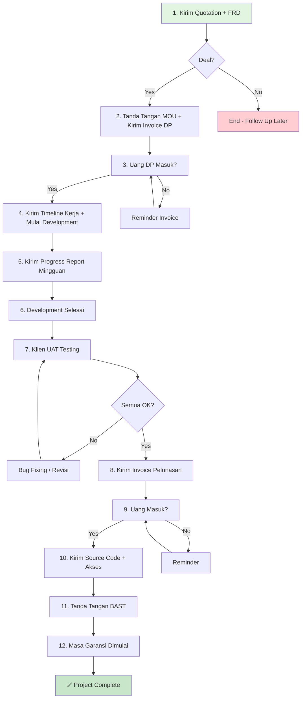

# 📋 PROJECT REQUIREMENTS & PRICING

## ANTITESA - CoffeeShop Enterprise CMS & E-Commerce Platform

**Version**: 2.1.0  
**Last Updated**: 15 Januari 2026  
**Document Owner**: [Your Name/Company]

---

## 📌 DAFTAR ISI

1. [Ringkasan Proyek](#ringkasan-proyek)
2. [SOP & Checklist Kelengkapan Dokumen](#sop--checklist-kelengkapan-dokumen)
3. [Paket Harga & Layanan](#paket-harga--layanan)
4. [Functional Requirement Document (FRD)](#functional-requirement-document-frd)
5. [Timeline Pengerjaan](#timeline-pengerjaan)
6. [Syarat & Ketentuan](#syarat--ketentuan)
7. [Template Dokumen](#template-dokumen)

---

## 🎯 RINGKASAN PROYEK

### Tentang ANTITESA

Platform **Content Management System (CMS)** dan **E-Commerce** terintegrasi yang dirancang khusus untuk bisnis coffee shop modern. Sistem ini memungkinkan pemilik bisnis untuk:

- ✅ Mengelola konten website secara **zero-code** (drag & drop page builder)
- ✅ Manajemen produk dengan tracking **ingredient-level** (hingga takaran gram)
- ✅ Penjualan digital (Buku, Merchandise, Tiket Event)
- ✅ Dashboard admin dengan **4-tier access control** (Master Admin, Owner, Media Staff, Public)
- ✅ Audit trail lengkap untuk compliance & security
- ✅ Multi-device responsive (Desktop, Tablet, Mobile)

### Key Benefits

| Benefit | Penjelasan |
|---------|-----------|
| **No Vendor Lock-in** | Full source code + dokumentasi lengkap (untuk paket Enterprise) |
| **Scalable Architecture** | Siap untuk pertumbuhan bisnis (10K+ concurrent users) |
| **Security-First** | Master Lock mechanism, JWT rotation, Rate limiting |
| **SEO Optimized** | Meta tags, sitemap, structured data, fast page load |
| **Cost-Efficient** | Hemat biaya developer untuk update konten (media staff bisa handle sendiri) |

### Target Pengguna

1. **Coffee Shop Owner/Franchise** (Bisnis utama)
2. **Restoran/Café dengan produk kompleks** 
3. **Toko Retail dengan Digital Product** (Buku, Kursus Online)
4. **Event Organizer** (Ticketing sistem)

---

## 📋 SOP & CHECKLIST KELENGKAPAN DOKUMEN

Panduan administrasi untuk memastikan proyek berjalan aman, profesional, dan terhindar dari sengketa ("scope creep").

---

### 🟦 FASE 1: DEAL & KONTRAK (Pra-Produksi)

**Dokumen yang harus disiapkan sebelum satu baris kode pun ditulis.**

#### ✅ 1. Quotation / Penawaran Harga

**Fungsi**: Dokumen resmi penawaran harga yang mengikat kedua belah pihak.

**Isi Wajib**:
- [ ] Opsi paket harga (Basic/Professional/Enterprise)
- [ ] Breakdown biaya per fitur (jika custom)
- [ ] Masa berlaku penawaran (misal: harga ini valid selama 14 hari)
- [ ] Metode pembayaran (Transfer bank/Payment gateway)
- [ ] Detail rekening pembayaran
- [ ] Skema termin pembayaran (contoh: 40%-30%-30%)

**Status**: ⬜ Belum Dibuat | ⬜ Draft | ⬜ Dikirim ke Klien | ✅ Approved

**Template**: Lihat bagian [Template Quotation](#template-quotation)

---

#### ✅ 2. Functional Requirement Document (FRD) / Lampiran Teknis

**Fungsi**: Mengunci fitur agar tidak melebar. Ini adalah **"Jantung"** kesepakatan teknis.

**Isi Wajib**:
- [ ] Daftar fitur detail (per modul)
- [ ] Flowchart/Alur sistem (User Flow + System Architecture)
- [ ] Tech stack (Vue.js 3, Node.js, PostgreSQL, Cloudinary, dll)
- [ ] **Batasan (Limitation)**: Apa yang **TIDAK** dikerjakan (Penting!)
- [ ] Mockup/Wireframe (Low-fidelity atau High-fidelity)
- [ ] Estimasi timeline per fase

**Tips**: 
- ⚠️ Dokumen ini **harus dilampirkan** dan dirujuk dalam MOU
- ⚠️ Setiap perubahan FRD = **Change Request** (CR) dengan biaya tambahan

**Status**: ⬜ Belum Dibuat | ⬜ Draft | ⬜ Review Klien | ✅ Final & Ditandatangani

**Template**: Lihat bagian [Functional Requirement Document](#functional-requirement-document-frd)

---

#### ✅ 3. MOU / SPK (Surat Perjanjian Kerjasama)

**Fungsi**: Payung hukum yang mengikat hak dan kewajiban.

**Isi Wajib**:
- [ ] Identitas lengkap kedua belah pihak
- [ ] Ruang lingkup pekerjaan (merujuk ke FRD)
- [ ] Nilai kontrak & skema pembayaran
- [ ] Timeline pengerjaan (tanggal mulai - tanggal selesai)
- [ ] Hak Kekayaan Intelektual (IP Rights)
  - Paket Basic/Pro: **Source code milik developer**, klien hanya dapat akses deploy
  - Paket Enterprise: **Full source code transfer** ke klien
- [ ] Ketentuan garansi (1-3 bulan after go-live)
- [ ] Ketentuan maintenance (jika ada)
- [ ] Klausul force majeure & penyelesaian sengketa
- [ ] **Tanda tangan di atas materai Rp 10.000** kedua belah pihak

**Tips**:
- ⚠️ Gunakan materai elektronik (e-Meterai) untuk tandatangan digital
- ⚠️ Buat 2 salinan: 1 untuk developer, 1 untuk klien

**Status**: ⬜ Belum Dibuat | ⬜ Draft | ⬜ Negosiasi | ✅ Ditandatangani

**Template**: Lihat bagian [Template MOU](#template-mou-surat-perjanjian-kerjasama)

---

#### ✅ 4. Invoice Termin 1 (Down Payment)

**Fungsi**: Tagihan resmi untuk memicu pembayaran awal (DP).

**Isi Wajib**:
- [ ] Nomor invoice (format: INV/ANTITESA/2026/001)
- [ ] Tanggal invoice
- [ ] Item: "Down Payment ANTITESA Project - Paket [Basic/Pro/Enterprise]"
- [ ] Nominal (40% dari total nilai projekt)
- [ ] Metode pembayaran & detail rekening
- [ ] Jatuh tempo (misal: maksimal 7 hari setelah MOU ditandatangani)

**Aturan Emas**: 
> ⚠️ **JANGAN MULAI KERJA SEBELUM UANG MASUK REKENING**, sesuai MOU Pasal Pembayaran

**Status**: ⬜ Belum Dibuat | ⬜ Dikirim ke Klien | ✅ Dibayar Lunas

---

### 🟨 FASE 2: DEVELOPMENT (Selama Pengerjaan)

**Dokumen untuk menjaga transparansi dan mencairkan termin pembayaran lanjutan.**

#### ✅ 5. Project Timeline / Gantt Chart

**Fungsi**: Peta jalan agar klien tahu kapan fitur selesai.

**Isi**:
- [ ] Breakdown fase (Desain → Backend → Frontend → Testing → Deploy)
- [ ] Milestone per minggu
  - Minggu 1: Desain UI/UX & Database Schema
  - Minggu 2-3: Backend API Development
  - Minggu 4-5: Frontend Dashboard & CMS
  - Minggu 6: Frontend Storefront
  - Minggu 7: Integration Testing & Bug Fixing
  - Minggu 8: Deployment & User Training
- [ ] Dependencies (fitur A harus selesai sebelum fitur B dimulai)

**Tools yang Bisa Digunakan**:
- Notion (Free, mudah share ke klien)
- Trello + Power-Up Gantt Chart
- Google Sheets + Conditional Formatting
- Microsoft Project (untuk klien enterprise)

**Update**: Minimal **1x per minggu** atau setiap ada perubahan signifikan

**Status**: ⬜ Belum Dibuat | ⬜ Shared ke Klien | ✅ Update Berkala

---

#### ✅ 6. Berita Acara Progres (BAP) / Progress Report

**Fungsi**: Laporan berkala (mingguan/dwimingguan) agar klien merasa aman.

**Isi**:
- [ ] Progress minggu ini (% completion)
- [ ] Fitur yang sudah diselesaikan (dengan screenshot/demo link)
- [ ] Fitur yang sedang dikerjakan minggu depan
- [ ] Kendala/blocker (jika ada) beserta solusinya
- [ ] Request dari klien (jika ada)

**Format Kirim**:
- Email ke klien setiap **Jumat sore** (atau jadwal yang disepakati)
- Lampirkan screenshot atau link demo environment
- Simpan di shared folder (Google Drive/Notion)

**Template**:
```markdown
## Progress Report - Minggu ke-3 (13-19 Januari 2026)

**Overall Progress**: 45% ✅

### ✅ Completed This Week
1. Database schema final + migrations
2. Authentication API (Login, Logout, JWT rotation)
3. Product CRUD API with ingredient tracking
4. Admin Dashboard - Product Management UI

**Demo**: https://staging.antitesa.com (user: demo@test.com, pass: Demo123!)

### 🚧 In Progress (Next Week)
1. CMS Page Builder (drag & drop functionality)
2. Cloudinary integration for image uploads
3. Role-based access control middleware

### ⚠️ Blockers
- Menunggu logo final dari klien (untuk dashboard header)

### 📌 Notes
Klien request tambahan: Export PDF untuk laporan penjualan → Akan dikerjakan minggu ke-6 sesuai timeline.
```

**Status**: ⬜ Belum Rutin | ✅ Update Setiap Minggu

---

#### ✅ 7. Invoice Termin 2 (Progress Payment)

**Fungsi**: Menagih pembayaran tengah (jika ada termin ke-2).

**Timing**: Dikirimkan saat progress mencapai **50-60%** atau sesuai milestone yang disepakati.

**Syarat**:
- [ ] Dikirimkan bersamaan dengan **Berita Acara Progress** yang membuktikan pencapaian milestone
- [ ] Demo environment harus sudah bisa diakses klien
- [ ] Fitur-fitur core sudah berfungsi (minimal CRUD operasi)

**Isi Wajib**:
- [ ] Nomor invoice
- [ ] Item: "Progress Payment - ANTITESA Project (50% completion)"
- [ ] Nominal (30% dari total nilai proyek)
- [ ] Jatuh tempo (misal: 7 hari setelah invoice diterima)

**Status**: ⬜ Belum Dibuat | ⬜ Dikirim | ✅ Dibayar Lunas

---

### 🟩 FASE 3: HANDOVER (Serah Terima & Penutupan)

**Fase paling krusial. Jangan serahkan kode final sebelum dokumen ini beres.**

#### ✅ 8. UAT Document (User Acceptance Test)

**Fungsi**: Dokumen checklist pengujian oleh klien.

**Cara Pakai**: 
1. Developer membuat checklist semua fitur sesuai FRD
2. Klien harus **mencentang** setiap fitur dan **tanda tangan** "Approved" di setiap modul
3. Jika ada bug/error, dicatat sebagai "Revision Needed"
4. Setelah semua "Approved", baru lanjut ke pelunasan

**Penting**: 
> Jika klien komplain fitur error di kemudian hari, Anda bisa tunjukkan dokumen ini: 
> **"Bapak sudah cek dan tanda tangan 'OK' di sini pada tanggal [X]"**

**Template**:

```markdown
# User Acceptance Test (UAT) Document
**Project**: ANTITESA CMS  
**Testing Period**: 5-7 Februari 2026  
**Tester**: [Nama Klien], [Jabatan]

---

## MODULE 1: Authentication & User Management

| No | Fitur | Kriteria Sukses | Status | Catatan | Tanda Tangan |
|----|-------|-----------------|--------|---------|--------------|
| 1.1 | Login dengan email & password | User bisa login dengan kredensial benar, redirect ke dashboard | ☑️ Pass | - | [____] |
| 1.2 | Logout | User bisa logout, token dihapus, redirect ke login | ☑️ Pass | - | [____] |
| 1.3 | Master Lock | Admin bisa lock/unlock user, user yang di-lock tidak bisa login | ☑️ Pass | - | [____] |
| 1.4 | Ganti Password | User bisa ubah password sendiri | ☑️ Pass | - | [____] |

**Approver**: [____________________]  
**Date**: [____________________]

---

## MODULE 2: Product Management

| No | Fitur | Kriteria Sukses | Status | Catatan | Tanda Tangan |
|----|-------|-----------------|--------|---------|--------------|
| 2.1 | Tambah Produk | Admin bisa tambah produk dengan ingredient & varian | ☑️ Pass | - | [____] |
| 2.2 | Edit Produk | Admin bisa edit nama, harga, deskripsi, gambar | ☑️ Pass | - | [____] |
| 2.3 | Hapus Produk | Admin bisa hapus produk, ingredient ikut terhapus (cascade) | ☑️ Pass | - | [____] |
| 2.4 | Upload Gambar Produk | Gambar terupload ke Cloudinary, tampil di storefront | ☑️ Pass | - | [____] |

**Approver**: [____________________]  
**Date**: [____________________]

---

## MODULE 3: CMS Page Builder

| No | Fitur | Kriteria Sukses | Status | Catatan | Tanda Tangan |
|----|-------|-----------------|--------|---------|--------------|
| 3.1 | Drag & Drop Section | Media staff bisa reorder section dengan drag & drop | ☑️ Pass | - | [____] |
| 3.2 | Edit Hero Banner | Bisa ubah title, subtitle, background image, CTA button | ☑️ Pass | - | [____] |
| 3.3 | Publish/Unpublish Page | Perubahan di dashboard langsung reflect di storefront | ☑️ Pass | - | [____] |

**Approver**: [____________________]  
**Date**: [____________________]

---

## FINAL APPROVAL

☑️ Saya menyatakan bahwa semua fitur telah di-test dan berfungsi sesuai Functional Requirement Document.

**Nama Lengkap**: [_______________________________]  
**Jabatan**: [_______________________________]  
**Tanda Tangan**: [_______________________________]  
**Tanggal**: [_______________________________]  
**Materai Rp 10.000**: [Tempel di sini]
```

**Status**: ⬜ Belum UAT | ⬜ Dalam Proses | ⬜ Ada Revisi | ✅ Approved

---

#### ✅ 9. Invoice Termin 3 (Pelunasan)

**Fungsi**: Tagihan terakhir.

**Timing**: Dikirimkan **SETELAH UAT Document ditandatangani** oleh klien.

**Isi Wajib**:
- [ ] Nomor invoice
- [ ] Item: "Final Payment - ANTITESA Project (Project Completion)"
- [ ] Nominal (30% dari total nilai proyek)
- [ ] Jatuh tempo (misal: 7 hari setelah invoice diterima)

**Aturan Emas**: 
> ⚠️ **Kirim Invoice Pelunasan → Tunggu Uang Masuk → BARU kirim Source Code/Akses Server**

**Jangan Pernah**:
- ❌ Transfer source code sebelum pelunasan
- ❌ Berikan akses production server sebelum pelunasan
- ❌ Transfer ownership domain/hosting sebelum pelunasan

**Status**: ⬜ Belum Dibuat | ⬜ Dikirim | ✅ Dibayar Lunas

---

#### ✅ 10. BAST (Berita Acara Serah Terima)

**Fungsi**: Dokumen pamungkas yang menyatakan kontrak selesai.

**Isi**:
- [ ] Pernyataan bahwa pekerjaan telah diterima dengan baik
- [ ] Konfirmasi pembayaran telah lunas
- [ ] Tanggal mulai masa garansi (misal: 1 bulan sejak tanggal BAST)
- [ ] Daftar aset yang diserahkan:
  - Source code (untuk paket Enterprise)
  - Akses admin panel (email & password)
  - Akses hosting/server (jika managed by developer)
  - Database backup
  - Dokumentasi teknis
- [ ] Tanda tangan kedua belah pihak (di atas materai)

**Template**:

```markdown
# BERITA ACARA SERAH TERIMA (BAST)
**Nomor**: BAST/ANTITESA/2026/001

Yang bertanda tangan di bawah ini:

**PIHAK PERTAMA (Developer)**  
Nama: [Nama Developer/PT]  
Alamat: [Alamat Lengkap]  
Selanjutnya disebut sebagai **PENGEMBANG**

**PIHAK KEDUA (Klien)**  
Nama: [Nama Klien/PT]  
Alamat: [Alamat Lengkap]  
Selanjutnya disebut sebagai **KLIEN**

---

Dengan ini menyatakan telah melakukan **SERAH TERIMA** pekerjaan pengembangan Website/Aplikasi dengan rincian sebagai berikut:

## 1. IDENTITAS PROYEK
- **Nama Proyek**: ANTITESA - CoffeeShop Enterprise CMS
- **Nomor Kontrak**: MOU/ANTITESA/2026/001
- **Nilai Kontrak**: Rp [NOMINAL] (Terbilang: [...])
- **Periode Pengerjaan**: [Tanggal Mulai] s/d [Tanggal Selesai]

## 2. RUANG LINGKUP YANG DISERAHKAN

☑️ Aplikasi Web (Frontend + Backend) telah berfungsi penuh sesuai FRD  
☑️ Source Code (untuk Paket Enterprise) / Akses Deploy (untuk Paket Basic/Pro)  
☑️ Database (PostgreSQL) dengan data dummy/real sesuai kesepakatan  
☑️ Akses Admin Panel:
- URL: https://admin.antitesa.com
- Email: [email_klien]
- Password: [password_temporary]

☑️ Dokumentasi Teknis (README.md, API Documentation)  
☑️ User Manual (Panduan Penggunaan untuk Admin)  

## 3. KONFIRMASI PEMBAYARAN

☑️ Pembayaran Termin 1 (40%): Rp [NOMINAL] - Tanggal: [DD/MM/YYYY]  
☑️ Pembayaran Termin 2 (30%): Rp [NOMINAL] - Tanggal: [DD/MM/YYYY]  
☑️ Pembayaran Termin 3 (30%): Rp [NOMINAL] - Tanggal: [DD/MM/YYYY]  

**Total Dibayar**: Rp [NOMINAL] ✅ **LUNAS**

## 4. MASA GARANSI

PENGEMBANG memberikan garansi **[1/3] bulan** terhitung sejak tanggal BAST ini ditandatangani, yang mencakup:
- ✅ Perbaikan bug/error yang muncul akibat kode program
- ✅ Minor adjustment UI/UX yang tidak mengubah struktur database
- ❌ **TIDAK termasuk**: Penambahan fitur baru, perubahan alur bisnis, atau kesalahan dari pihak klien

## 5. KETENTUAN LAINNYA

1. Untuk penambahan fitur di luar FRD, dikenakan biaya **Change Request** sesuai kompleksitas.
2. Maintenance rutin (update security, backup, monitoring) **TIDAK termasuk** dalam garansi. Jika diperlukan, gunakan Paket Maintenance terpisah.
3. Klien bertanggung jawab untuk menjaga kerahasiaan akses login dan tidak membagikan kepada pihak ketiga.

---

Demikian Berita Acara ini dibuat dalam rangkap 2 (dua) dan ditandatangani oleh kedua belah pihak dalam keadaan sadar dan tanpa paksaan.

**[Kota], [Tanggal]**

**PIHAK PERTAMA (Pengembang)**  
Materai Rp 10.000

[____________________]  
Nama Lengkap & Tanda Tangan

**PIHAK KEDUA (Klien)**  
Materai Rp 10.000

[____________________]  
Nama Lengkap & Tanda Tangan
```

**Status**: ⬜ Belum Dibuat | ⬜ Draft | ✅ Ditandatangani Kedua Belah Pihak

---

#### ✅ 11. Dokumentasi Teknis & Manual Book (Opsional tapi Premium)

**Fungsi**: Panduan untuk tim IT klien atau user akhir.

**Isi**:

**A. Technical Documentation (untuk IT Team)**
- [ ] Cara instalasi lokal (untuk development)
- [ ] Cara deployment ke production
- [ ] Environment variables explanation
- [ ] Database Schema (ERD)
- [ ] API Documentation (Postman Collection atau Swagger)
- [ ] Troubleshooting common issues

**B. User Manual (untuk End User)**
- [ ] Cara login dan logout
- [ ] Cara menambah/edit produk (dengan screenshot)
- [ ] Cara menggunakan Page Builder (drag & drop)
- [ ] Cara upload gambar
- [ ] Cara melihat laporan penjualan
- [ ] FAQ

**Format**: PDF atau Notion shared page (lebih mudah update)

**Status**: ⬜ Tidak Diperlukan | ⬜ Dalam Proses | ✅ Diserahkan

---

## 📊 RINGKASAN ALUR KERJA ("THE HAPPY PATH")



**Checklist Lengkap**:

- [ ] 1. Quotation dikirim & approved
- [ ] 2. FRD final & ditandatangani
- [ ] 3. MOU ditandatangani (dengan materai)
- [ ] 4. Invoice DP dikirim & dibayar
- [ ] 5. Timeline shared ke klien
- [ ] 6. Progress report rutin setiap minggu
- [ ] 7. Invoice Progress Payment (jika ada termin 2)
- [ ] 8. UAT Document diisi & ditandatangani klien
- [ ] 9. Invoice Pelunasan dikirim & dibayar
- [ ] 10. Source code/akses diserahkan
- [ ] 11. BAST ditandatangani
- [ ] 12. Dokumentasi diserahkan
- [ ] 13. Project masuk masa garansi

---

## 💰 PAKET HARGA & LAYANAN

### Strategi Pricing: **Good - Better - Best**

Kami menyediakan 3 (tiga) paket yang disesuaikan dengan skala bisnis dan kebutuhan klien.

---

### 📦 PAKET 1: BASIC STARTER

**Target**: Small Business / Startup Coffee Shop (1-2 outlet)

**💵 Harga**: **Rp 25.000.000** (Dua Puluh Lima Juta Rupiah)

**Skema Pembayaran**: 40% (DP) - 30% (Progress) - 30% (Pelunasan)

---

#### ✅ Fitur yang Didapat

**A. Frontend (Public Website)**
- ☑️ Landing Page (1 halaman) dengan desain custom
  - Hero Section (Banner utama)
  - Product Showcase (Grid 6-12 produk)
  - About Us Section
  - Contact Form
  - Footer dengan social media links
- ☑️ Product Detail Page (untuk setiap produk)
- ☑️ Responsive design (Desktop, Tablet, Mobile)
- ☑️ Basic SEO (Meta tags, sitemap.xml, robots.txt)

**B. Backend (Admin Dashboard)**
- ☑️ Authentication System (Login/Logout)
- ☑️ Product Management
  - CRUD Products (Create, Read, Update, Delete)
  - Upload gambar produk (Cloudinary integration)
  - Kategori produk (max 5 kategori)
  - Ingredient tracking (daftar bahan, takaran, satuan)
  - Product variant (Hot/Ice, Size, Extra)
- ☑️ User Management (Basic)
  - 2 level akses: Admin Owner & Staff
  - Max 3 user accounts
- ☑️ Dashboard Overview
  - Statistik total produk
  - Recent activities

**C. Infrastructure & Deployment**
- ☑️ Deployment ke shared hosting / VPS basic (yang disediakan klien)
- ☑️ Cloudinary Free Tier (untuk image storage, max 25GB)
- ☑️ Database setup (PostgreSQL)
- ☑️ SSL Certificate (Let's Encrypt - free)

**D. After-Sales**
- ☑️ **Garansi 1 bulan** (bug fixing)
- ☑️ **User Training 1 sesi** (2 jam via Zoom, cara pakai admin panel)
- ☑️ Dokumentasi User Manual (PDF)

---

#### ⚠️ Keterbatasan (Limitation)

- ❌ **TIDAK termasuk domain & hosting** (klien sediakan sendiri)
- ❌ **TIDAK ada sistem pembayaran online** (e-commerce checkout)
- ❌ **TIDAK ada CMS Page Builder** (layout landing page fixed, tidak bisa diubah sendiri oleh klien)
- ❌ **Source code TIDAK diserahkan** (remain di developer, klien hanya dapat akses deploy)
- ❌ **TIDAK ada fitur E-commerce** (shopping cart, checkout, order management)
- ❌ **TIDAK ada Audit Trail / Activity Logs**
- ❌ **TIDAK ada Advanced Analytics**

---

#### 🕐 Timeline Pengerjaan

**Estimasi**: **4-5 minggu**

- Week 1: Desain UI/UX + Database Schema
- Week 2: Backend API (Product CRUD)
- Week 3: Frontend Landing Page + Dashboard
- Week 4: Testing & Bug Fixing
- Week 5: Deployment & Training

---

#### 📌 Cocok Untuk

- ✅ Coffee shop pemula yang baru buka (1 outlet)
- ✅ Hanya butuh katalog produk online (belum jualan online)
- ✅ Budget terbatas
- ✅ Tidak butuh update konten website secara rutin

---

### 📦 PAKET 2: PROFESSIONAL ⭐ (MOST POPULAR)

**Target**: Growing Business / Franchise (3-10 outlet)

**💵 Harga**: **Rp 50.000.000** (Lima Puluh Juta Rupiah)

**Skema Pembayaran**: 40% (DP) - 30% (Progress) - 30% (Pelunasan)

---

#### ✅ Fitur yang Didapat

**Semua fitur di Paket Basic, PLUS:**

**A. Frontend Enhancement**
- ☑️ Multi-page website (Home, About, Products, Events, Contact)
- ☑️ **CMS Page Builder** (Drag & Drop)
  - Media staff bisa ubah urutan section sendiri
  - Edit text, gambar, button link tanpa coding
  - Live preview sebelum publish
- ☑️ **Digital Library** (untuk jual buku/e-book)
  - Upload PDF
  - Custom styling per buku (font, warna, layout)
- ☑️ **Event Management** (untuk coffee tasting, workshop)
  - Kalender event
  - Detail event page
  - Registration form (belum payment)
- ☑️ Blog/News section (untuk artikel kopi, tips brewing)

**B. Backend Enhancement**
- ☑️ **Advanced Product Management**
  - Unlimited categories
  - Bulk upload produk (via CSV/Excel)
  - Product analytics (most viewed, most sold)
- ☑️ **User Management (Advanced)**
  - 4 level akses: Master Admin, Owner, Media Staff, Public
  - **Master Lock** mechanism (freeze account)
  - Max 10 user accounts
- ☑️ **Activity Logs / Audit Trail**
  - Track siapa ubah apa, kapan, dan apa saja yang berubah
  - Export log to CSV
- ☑️ **Merchandise Management**
  - Kelola produk non-kopi (baju, tumbler, alat seduh)
  - Varian SKU
- ☑️ **Fun Facts Module**
  - Konten edukatif tentang kopi
  - Comment system (perlu approval)

**C. Analytics & Reporting**
- ☑️ Dashboard Analytics
  - Sales trends (jika ada integrasi e-commerce)
  - Popular products
  - User engagement metrics
- ☑️ **Reporting**
  - Export laporan produk (PDF/Excel)
  - Filter by date range, category

**D. Infrastructure**
- ☑️ VPS deployment (DigitalOcean/AWS EC2 - yang disediakan klien)
- ☑️ Cloudinary Pro Plan setup (jika diperlukan, biaya klien)
- ☑️ Redis setup (untuk caching & session) - optional
- ☑️ Automated backup script (database backup daily)

**E. After-Sales**
- ☑️ **Garansi 3 bulan** (bug fixing + minor adjustment)
- ☑️ **User Training 3 sesi**
  - Sesi 1: Admin panel overview
  - Sesi 2: CMS Page Builder
  - Sesi 3: Analytics & Reporting
- ☑️ Dokumentasi lengkap (User Manual + Basic Technical Docs)
- ☑️ **1 bulan support via WhatsApp** (response 1x24 jam)

---

#### ⚠️ Keterbatasan

- ❌ **TIDAK termasuk domain & hosting** (klien sediakan sendiri, kami bantu setup)
- ❌ **TIDAK ada Payment Gateway integration** (belum bisa terima pembayaran online)
- ❌ **TIDAK ada Shopping Cart & Checkout** (katalog only)
- ❌ **Source code TIDAK diserahkan** (remain di developer, klien dapat akses repository read-only)
- ❌ **TIDAK ada Mobile App** (hanya web responsive)

---

#### 🕐 Timeline Pengerjaan

**Estimasi**: **6-8 minggu**

- Week 1-2: Desain UI/UX (semua halaman) + Database Schema final
- Week 3-4: Backend Development (semua modul API)
- Week 5-6: Frontend (CMS Builder + Dashboard + Storefront)
- Week 7: Integration Testing & UAT
- Week 8: Deployment + Training + Go-Live

---

#### 📌 Cocok Untuk

- ✅ Coffee shop yang sudah established (3-10 outlet)
- ✅ Butuh update konten website secara mandiri (tanpa hire developer)
- ✅ Punya tim media/marketing in-house
- ✅ Ingin jual produk digital (buku, merchandise)
- ✅ Sering adakan event (coffee tasting, workshop)
- ✅ Butuh sistem audit untuk compliance

---

### 📦 PAKET 3: ENTERPRISE 🏆

**Target**: Large Business / Multi-brand Franchise (10+ outlet)

**💵 Harga**: **Rp 100.000.000** (Seratus Juta Rupiah)

**Skema Pembayaran**: 40% (DP) - 30% (Progress) - 30% (Pelunasan)

---

#### ✅ Fitur yang Didapat

**Semua fitur di Paket Professional, PLUS:**

**A. E-Commerce Full Stack**
- ☑️ **Shopping Cart & Checkout System**
  - Add to cart, cart summary, quantity adjustment
  - Checkout form (delivery address, notes)
- ☑️ **Payment Gateway Integration**
  - Midtrans / Xendit / Doku (pilih 1)
  - Multiple payment methods (Credit Card, E-wallet, Virtual Account, QRIS)
  - Auto-update order status setelah payment
- ☑️ **Order Management**
  - Admin bisa lihat semua orders
  - Update order status (Pending → Processing → Shipped → Completed)
  - Print invoice/receipt
  - Email notification ke customer (order confirmation, shipping update)
- ☑️ **Customer Account**
  - Customer bisa register & login
  - Order history
  - Wishlist / Favorite products
  - Loyalty Points system (opsional, butuh diskusi lebih lanjut)

**B. Advanced Features**
- ☑️ **Multi-tenant Architecture** (jika franchise)
  - 1 aplikasi untuk multiple brand/outlet
  - Setiap outlet punya admin sendiri
  - Central dashboard untuk owner
- ☑️ **Inventory Management**
  - Real-time stock tracking
  - Low stock alert (email/WhatsApp notification)
  - Stock adjustment history
  - Supplier management (opsional)
- ☑️ **Advanced Analytics**
  - Sales dashboard dengan chart interaktif
  - Best-selling products
  - Revenue trends (daily, weekly, monthly)
  - Customer demographics
  - Conversion rate tracking
- ☑️ **Custom Report Builder**
  - Buat laporan custom dengan filter (tanggal, produk, kategori, outlet)
  - Auto-generate report (scheduled email setiap akhir bulan)
  - Export to PDF/Excel/CSV
- ☑️ **Email Marketing Integration** (opsional)
  - Newsletter blast
  - Abandoned cart reminder
  - Birthday discount email

**C. Security & Compliance**
- ☑️ **Advanced Security**
  - Two-Factor Authentication (2FA) untuk admin
  - IP Whitelisting untuk akses admin panel
  - Encrypted database backup
  - Security audit log (track suspicious activities)
- ☑️ **GDPR Compliance** (for international customers)
  - Data export for user
  - Right to be forgotten (delete user data)
  - Cookie consent banner
- ☑️ **Penetration Testing** (basic, via OWASP tools)

**D. Infrastructure Premium**
- ☑️ **Production-grade deployment**
  - AWS / Google Cloud Platform (setup by us, cost by client)
  - Load balancer untuk high traffic
  - Auto-scaling configuration
  - CDN setup (CloudFlare Pro)
  - Database replication (master-slave)
- ☑️ **CI/CD Pipeline**
  - GitHub Actions setup
  - Automated testing before deploy
  - Zero-downtime deployment
- ☑️ **Monitoring & Alerting**
  - Uptime monitoring (UptimeRobot / Pingdom)
  - Error tracking (Sentry integration)
  - Performance monitoring (New Relic / AppDynamics)
  - Alert via Slack/Email jika server down

**E. After-Sales Premium**
- ☑️ **Garansi 6 bulan** (bug fixing + minor feature adjustment)
- ☑️ **User Training 5 sesi** (2 jam per sesi)
  - Sesi 1: Admin panel overview
  - Sesi 2: CMS Page Builder & Content Management
  - Sesi 3: Product & Inventory Management
  - Sesi 4: Order Processing & Customer Management
  - Sesi 5: Analytics, Reporting, & Advanced Features
- ☑️ **Dokumentasi Lengkap**
  - User Manual (50+ halaman)
  - Technical Documentation (API docs, deployment guide, troubleshooting)
  - Video Tutorial (screen recording)
- ☑️ **3 bulan priority support**
  - WhatsApp/Email support (response < 4 jam di jam kerja)
  - 1 dedicated support person
  - Monthly check-in call (review performance, discuss improvement)
- ☑️ **FULL SOURCE CODE TRANSFER**
  - GitHub repository ownership transfer ke klien
  - Klien bebas modify atau hire developer lain untuk maintenance
  - Dokumentasi setup environment lengkap

**F. Optional Add-ons** (biaya terpisah, diskusi saat kick-off)
- 🔹 **Mobile App** (React Native - iOS + Android) → +Rp 75.000.000
- 🔹 **WhatsApp Integration** (order via WA, notifikasi WA) → +Rp 15.000.000
- 🔹 **POS System Integration** (sync dengan mesin kasir offline) → +Rp 50.000.000
- 🔹 **AI-Powered Recommendation** (suggest products based on user behavior) → +Rp 30.000.000
- 🔹 **Subscription/Membership System** (coffee subscription box) → +Rp 25.000.000

---

#### 🕐 Timeline Pengerjaan

**Estimasi**: **10-14 minggu** (2,5 - 3,5 bulan)

- Week 1-2: Requirement finalization, Wireframe, Database Schema
- Week 3-5: Backend Development (API + E-commerce logic)
- Week 6-8: Frontend Development (Dashboard + Storefront + Checkout)
- Week 9-10: Payment Gateway Integration & Testing
- Week 11-12: Security Audit, Performance Optimization
- Week 13: User Acceptance Testing (UAT)
- Week 14: Deployment, Training, Go-Live

---

#### 📌 Cocok Untuk

- ✅ Franchise besar (10+ outlet)
- ✅ Ingin jual online (e-commerce sempurna)
- ✅ Butuh sistem inventory terintegrasi
- ✅ Ingin full ownership atas source code
- ✅ Punya tim IT sendiri yang bisa maintain kedepannya
- ✅ Budget cukup untuk investasi jangka panjang
- ✅ Ekspansi ke online sales (bukan hanya katalog)

---

## 📊 PERBANDINGAN PAKET

| Fitur | Basic | Professional | Enterprise |
|-------|:-----:|:------------:|:----------:|
| **Harga** | Rp 25jt | Rp 50jt | Rp 100jt |
| **Timeline** | 4-5 minggu | 6-8 minggu | 10-14 minggu |
| **Landing Page** | ✅ 1 halaman | ✅ Multi-page | ✅ Multi-page |
| **CMS Page Builder** | ❌ | ✅ | ✅ |
| **Product Management** | ✅ Basic | ✅ Advanced | ✅ Advanced + Inventory |
| **User Roles** | 2 level (3 users) | 4 level (10 users) | 4 level (Unlimited) |
| **Digital Library** | ❌ | ✅ | ✅ |
| **Event Management** | ❌ | ✅ | ✅ |
| **Merchandise** | ❌ | ✅ | ✅ |
| **Audit Trail** | ❌ | ✅ | ✅ + Security Log |
| **Shopping Cart** | ❌ | ❌ | ✅ |
| **Payment Gateway** | ❌ | ❌ | ✅ (Midtrans/Xendit) |
| **Order Management** | ❌ | ❌ | ✅ |
| **Customer Account** | ❌ | ❌ | ✅ |
| **Analytics** | Basic | Advanced | Premium + Custom Reports |
| **Source Code** | ❌ Tidak diserahkan | ❌ Read-only | ✅ **Full ownership** |
| **Garansi** | 1 bulan | 3 bulan | 6 bulan |
| **Training** | 1 sesi | 3 sesi | 5 sesi |
| **Support** | Email only | WhatsApp 1 bulan | Priority 3 bulan |
| **CI/CD Pipeline** | ❌ | ❌ | ✅ |
| **Security Audit** | ❌ | ❌ | ✅ |
| **Monitoring** | ❌ | ❌ | ✅ (Sentry + Uptime) |

---

## 💡 REKOMENDASI KAMI

### 🥉 Pilih **BASIC** jika:
- Bisnis masih tahap validasi (baru buka 1-2 bulan)
- Hanya butuh company profile + katalog produk
- Budget terbatas (< Rp 30jt)
- Belum butuh update website rutin

### 🥈 Pilih **PROFESSIONAL** jika: (⭐ Paling Populer)
- Bisnis sudah jalan 1-2 tahun
- Punya tim marketing/media yang bisa maintain content
- Butuh fleksibilitas ubah layout tanpa developer
- Ingin jual produk digital (buku, merchandise)
- Sering ada event/workshop
- **Best value for money!**

### 🥇 Pilih **ENTERPRISE** jika:
- Franchise besar atau planning ekspansi ke e-commerce
- Ingin sistem penjualan online lengkap
- Butuh ownership penuh (source code)
- Punya tim IT in-house untuk long-term maintenance
- Butuh fitur advanced (inventory, custom reports, security audit)
- **Investasi jangka panjang**

---

## 📝 BIAYA TAMBAHAN (di luar paket)

Biaya-biaya berikut **TIDAK TERMASUK** dalam paket dan menjadi tanggung jawab klien:

| Item | Estimasi Biaya | Frekuensi | Catatan |
|------|----------------|-----------|---------|
| **Domain (.com)** | Rp 150rb - 200rb/tahun | Tahunan | Bisa beli di Niagahoster, Dewaweb, GoDaddy |
| **Hosting VPS** | Rp 100rb - 500rb/bulan | Bulanan | Tergantung spesifikasi (RAM, Storage) |
| **SSL Certificate** | GRATIS (Let's Encrypt) | - | Jika butuh SSL premium (Rp 500rb/tahun) |
| **Cloudinary** | GRATIS (Free Tier 25GB)<br/>Paid Plan mulai $99/bulan | Bulanan | Jika upload image > 25GB |
| **Payment Gateway** | Biaya transaksi 2-3% | Per transaksi | Midtrans: 2%, Xendit: 2,9% + Rp 2.000 |
| **Email Service** | Rp 0 - $15/bulan | Bulanan | SMTP Gmail gratis (limit 500 email/day)<br/>SendGrid/Mailgun paid jika butuh lebih |
| **AWS/GCP** | Mulai $10-50/bulan | Bulanan | Untuk Paket Enterprise (if needed) |
| **Materai** | Rp 10.000 per dokumen | Sekali | Untuk MOU, BAST, Invoice |

---

## 💳 METODE PEMBAYARAN

Kami menerima pembayaran melalui:

1. **Transfer Bank**
   - BCA: [Nomor Rekening]
   - Mandiri: [Nomor Rekening]
   - BNI: [Nomor Rekening]

2. **E-Wallet** (untuk pembayaran termin, bukan total)
   - OVO
   - GoPay
   - Dana

3. **PayPal / Wise** (untuk klien luar negeri)

**Bukti Transfer**: Wajib dikirimkan ke WhatsApp/Email setelah transfer.

---

## 🎁 PROMO & DISKON

### Diskon Early Bird
- 💰 **5% OFF** untuk pembayaran penuh (LUNAS) di awal (tanpa termin)
- 💰 **10% OFF** untuk klien yang referral dari klien sebelumnya
- 💰 **Bundle Discount**: Paket Professional + Maintenance 1 tahun = Diskon Rp 5jt

### Program Referral
- Rekomendasikan kami ke teman/partner bisnis Anda
- Dapatkan **komisi 5%** dari total nilai proyek yang mereka ambil
- Atau pilihan: **1 bulan maintenance gratis** untuk proyek Anda

---

## 📅 MASA BERLAKU PENAWARAN

Harga yang tertera dalam dokumen ini **BERLAKU hingga 31 Maret 2026**.

Setelah tanggal tersebut, harga dapat berubah menyesuaikan:
- Kurs USD (untuk tool/service berbasis dollar)
- Inflasi
- Update major framework/library

**Note**: Jika Anda sudah menerima quotation personal dengan harga spesial, harga tersebut tetap berlaku sesuai masa berlaku yang tertera di quotation Anda.

---

## 📞 HUBUNGI KAMI

**Developer**: [Nama Lengkap / PT]  
**WhatsApp**: +62 [Nomor Anda]  
**Email**: dev@antitesa.com  
**Website**: https://antitesa.com  
**Portfolio**: [Link ke portfolio project sebelumnya]

**Jam Operasional**:  
Senin - Jumat: 09.00 - 18.00 WIB  
Sabtu: 09.00 - 14.00 WIB  
Minggu & Tanggal Merah: LIBUR

**Response Time**:
- WhatsApp: < 2 jam (di jam kerja)
- Email: < 24 jam

---

*Dokumen ini bersifat rahasia dan hanya untuk pihak yang berkepentingan. Dilarang memperbanyak atau menyebarluaskan tanpa izin tertulis.*

**Last Updated**: 15 Januari 2026  
**Document Version**: 1.0

---

## 📐 FUNCTIONAL REQUIREMENT DOCUMENT (FRD)

### 1. SISTEM OVERVIEW

ANTITESA adalah platform **all-in-one** untuk bisnis coffee shop yang menggabungkan:
- **CMS (Content Management System)**: Untuk kelola konten website tanpa coding
- **E-Commerce**: Untuk penjualan online (checkout, payment, order management)
- **Inventory Management**: Tracking stok produk & bahan baku (ingredient-level)
- **Digital Product Sales**: Jual buku digital, merchandise, tiket event
- **Analytics & Reporting**: Dashboard insight untuk business decision making

**Tech Stack**:
- **Frontend**: Vue.js 3 (Composition API) + Vite + Tailwind CSS
- **Backend**: Node.js + Express.js + TypeScript
- **Database**: PostgreSQL 15 (dengan JSONB untuk dynamic content)
- **ORM**: Prisma
- **File Storage**: Cloudinary CDN
- **Authentication**: JWT (Access Token + Refresh Token)
- **Deployment**: Docker + Docker Compose

---

### 2. USER ROLES & PERMISSIONS

| Role | Level | Hak Akses | Limitation |
|------|-------|-----------|------------|
| **Master Admin** | 0 | ✅ Full access<br/>✅ Lock/unlock any account<br/>✅ System configuration<br/>✅ View all audit logs | ❌ Cannot be locked by anyone |
| **Admin Owner** | 1 | ✅ Financial reports<br/>✅ User management (create/delete)<br/>✅ Product pricing<br/>✅ View team audit logs | ❌ Cannot lock Master Admin<br/>❌ Cannot access system config |
| **Media Staff** | 2 | ✅ CMS Page Builder<br/>✅ Upload images/videos<br/>✅ Edit content (Books, Events)<br/>✅ View own activity logs | ❌ Cannot view financial reports<br/>❌ Cannot edit product prices<br/>❌ Cannot manage users |
| **Public User** | 3 | ✅ Browse products<br/>✅ Register/login<br/>✅ Add to cart & checkout<br/>✅ View order history | ❌ No admin panel access |

**Master Lock Mechanism**:
- Master Admin dapat "freeze" akun siapapun (termasuk Owner)
- User yang di-lock tidak bisa login
- Frontend auto-logout jika terdeteksi account locked (real-time)

---

### 3. FITUR FUNGSIONAL (PER MODUL)

#### 🔐 MODULE 1: AUTHENTICATION

**User Stories**:
- Sebagai **user**, saya ingin login dengan email & password
- Sebagai **user**, saya ingin logout dan session saya dihapus
- Sebagai **Admin**, saya ingin reset password user yang lupa
- Sebagai **Master Admin**, saya ingin lock/unlock user account

**Features**:
1. **Login**
   - Input: Email, Password
   - Validasi: Email format, password minimal 8 karakter
   - Response: Access Token (15 menit), Refresh Token (30 hari)
   - Redirect: Ke dashboard sesuai role

2. **Logout**
   - Hapus token dari localStorage
   - Invalidate session di server (optional: blacklist refresh token)

3. **Refresh Token**
   - Otomatis refresh access token jika expired
   - Frontend tidak perlu re-login manual

4. **Lock/Unlock Account**
   - Master Admin bisa toggle `isLocked` status user
   - User yang di-lock tidak bisa login (401 Unauthorized)

**Non-Functional Requirements**:
- Password harus di-hash dengan bcrypt (salt rounds 10)
- Rate limiting: Max 5 login attempts per 15 menit per IP
- JWT secret minimal 32 karakter
- 2FA (Two-Factor Authentication) - **hanya untuk Paket Enterprise**

---

#### 📦 MODULE 2: PRODUCT MANAGEMENT

**User Stories**:
- Sebagai **Admin**, saya ingin menambah produk baru dengan ingredient detail
- Sebagai **Admin**, saya ingin edit harga, deskripsi, gambar produk
- Sebagai **Admin**, saya ingin hapus produk (cascade delete ingredients)
- Sebagai **Customer**, saya ingin melihat detail produk dengan ingredient breakdown

**Features**:

1. **CRUD Products**
   - Create: Form input nama, slug, kategori, harga, deskripsi, gambar
   - Read: Table produk dengan search, filter (kategori, status), pagination
   - Update: Edit inline atau modal form
   - Delete: Soft delete (set isActive = false) atau hard delete

2. **Ingredient Tracking**
   - Setiap produk punya list ingredient
   - Fields: `name`, `amount`, `unit` (GRAM/ML/SHOT/PCS), `iconUrl`, `cost`
   - Contoh: "Caramel Latte" = 18g Espresso Beans + 200ml Fresh Milk + 30ml Caramel Syrup
   - Icon ingredient bisa di-upload (SVG/PNG)

3. **Product Variants**
   - Varian harga: Hot (+Rp 0), Ice (+Rp 3.000), Large (+Rp 5.000), Extra Shot (+Rp 8.000)
   - Frontend calculate: Base Price + Sum of Selected Variants
   - Example: Latte Rp 45.000 + Ice Rp 3.000 + Large Rp 5.000 = **Rp 53.000**

4. **Category Management**
   - Admin bisa CRUD kategori (Coffee, Non-Coffee, Food, Merchandise)
   - Setiap kategori punya icon & sort order

5. **Image Upload**
   - Integration dengan Cloudinary
   - Auto-compress & convert to WebP
   - Generate multiple sizes (thumbnail, medium, large)

**Non-Functional Requirements**:
- Max upload file size: 5MB
- Allowed formats: JPG, PNG, WebP, SVG
- Product slug harus unique (auto-generate dari nama produk)
- Support bulk upload produk via CSV/Excel (Paket Pro & Enterprise)

---

#### 🎨 MODULE 3: CMS PAGE BUILDER

**User Stories**:
- Sebagai **Media Staff**, saya ingin ubah layout landing page tanpa coding
- Sebagai **Media Staff**, saya ingin drag & drop section (Hero, Product Grid, Text, Gallery)
- Sebagai **Media Staff**, saya ingin preview perubahan sebelum publish

**Features**:

1. **Page Management**
   - CRUD pages (Home, About, Products, Events, Contact, Custom pages)
   - URL slug customization
   - SEO fields (meta title, description, keywords, OG image)
   - Publish/Unpublish toggle

2. **Section Builder**
   - Jenis section yang tersedia:
     - **HERO**: Banner utama (title, subtitle, background image, CTA button)
     - **PRODUCTS**: Grid produk (bisa filter by category)
     - **BOOKS**: Showcase buku digital
     - **TEXT**: Rich text editor (heading, paragraph, list, link)
     - **GALLERY**: Grid gambar (foto kopi, interior café)
     - **EVENTS**: Upcoming events list
     - **CUSTOM**: Embed HTML/CSS (untuk advanced user)

3. **Drag & Drop Functionality**
   - Reorder section dengan drag & drop (library: `vuedraggable`)
   - Visual feedback saat drag (highlight drop zone)
   - Auto-save order ke database

4. **Live Preview**
   - Split screen: Editor (kiri) vs Preview (kanan)
   - Real-time update saat edit text/image
   - Preview mode: Desktop/Tablet/Mobile switch

5. **Content Editor**
   - Rich text editor (Tiptap)
   - Support: Bold, Italic, Heading (H1-H6), List, Link, Image
   - Upload image langsung dari editor

**Non-Functional Requirements**:
- **Hanya untuk Paket Professional & Enterprise** (Basic paket tidak ada Page Builder)
- Perubahan auto-save setiap 30 detik (draft)
- Publish button untuk apply changes ke production
- Version history (opsional, untuk Enterprise)

---

#### 📚 MODULE 4: DIGITAL LIBRARY (BOOKS)

**User Stories**:
- Sebagai **Admin**, saya ingin upload buku digital (PDF) dan set harga
- Sebagai **Admin**, saya ingin customize tampilan detail page buku (font, warna, layout)
- Sebagai **Customer**, saya ingin download buku yang sudah saya beli

**Features**:

1. **Book Management**
   - CRUD books (title, author, summary, cover image, price)
   - Upload PDF (disimpan di Cloudinary atau server)
   - Set stock (untuk buku fisik) atau unlimited (untuk digital)

2. **Custom Styling**
   - Setiap buku bisa punya styling sendiri (disimpan sebagai JSON)
   - Configurable: Font family, title size, title color, background color, accent color, layout (modern/classic)
   - Media staff edit via form (tanpa coding)

3. **Download Management**
   - Generate secure download link (with expiration)
   - Track download count per user
   - Watermark PDF dengan nama user (opsional, Enterprise only)

**Non-Functional Requirements**:
- Max PDF size: 50MB
- PDF disimpan di Cloudinary (Paket Pro+) atau local server (Paket Basic)
- Download link expire after 24 jam (user harus login ulang)

---

#### 🎫 MODULE 5: EVENT MANAGEMENT

**User Stories**:
- Sebagai **Admin**, saya ingin buat event kopi (coffee tasting, brewing workshop)
- Sebagai **Customer**, saya ingin daftar event dan bayar tiket (jika berbayar)
- Sebagai **Admin**, saya ingin lihat list peserta yang sudah register

**Features**:

1. **Event CRUD**
   - Fields: Title, slug, description, date & time, location, cover image, gallery
   - Pricing: Free atau Paid (set harga tiket)
   - Max participants (limited/unlimited)
   - Registration deadline

2. **Registration**
   - Customer isi form (nama, email, phone, notes)
   - Jika berbayar: redirect ke payment gateway (Paket Enterprise)
   - Admin approve/reject registration

3. **Participant Management**
   - Admin lihat list peserta (table dengan search & filter)
   - Export participant list to CSV/Excel
   - Send email blast ke semua peserta (reminder event)

**Non-Functional Requirements**:
- Event registration **tanpa payment** untuk Paket Basic & Pro (hanya form)
- Event registration **dengan payment** untuk Paket Enterprise (Midtrans integration)

---

#### 🛒 MODULE 6: E-COMMERCE (CHECKOUT & ORDER)

**User Stories**:
- Sebagai **Customer**, saya ingin add produk ke cart
- Sebagai **Customer**, saya ingin checkout dan bayar online
- Sebagai **Admin**, saya ingin lihat semua orders dan update status

**⚠️ HANYA UNTUK PAKET ENTERPRISE**

**Features**:

1. **Shopping Cart**
   - Add to cart (with quantity)
   - Update quantity (increase/decrease)
   - Remove from cart
   - Cart summary (subtotal, tax, shipping, grand total)
   - Persist cart di localStorage (jika belum login) atau database (jika sudah login)

2. **Checkout**
   - Form: Delivery address, phone, notes
   - Choose payment method (COD, Transfer Bank, E-wallet, Credit Card)
   - Apply coupon/promo code (opsional)
   - Confirm order

3. **Payment Gateway Integration**
   - **Midtrans** atau **Xendit** (pilih salah satu)
   - Support: Credit Card, E-wallet (GoPay, OVO, Dana), Virtual Account (BCA, Mandiri, BNI), QRIS
   - Payment flow:
     1. Customer klik "Pay Now"
     2. Redirect ke Midtrans payment page
     3. Customer pilih metode & bayar
     4. Midtrans callback ke backend (webhook)
     5. Update order status → "Paid"
     6. Send email confirmation ke customer

4. **Order Management**
   - Admin dashboard: Table semua orders
   - Filter by status (Pending, Paid, Processing, Shipped, Completed, Cancelled)
   - Update status manual (dropdown)
   - Print invoice (PDF)
   - Email notification ke customer saat status berubah

5. **Customer Account**
   - Register/login
   - Profile page (edit nama, email, phone, alamat)
   - Order history (table dengan status tracking)
   - Reorder (copy items from previous order ke cart)

**Non-Functional Requirements**:
- Payment gateway fee: Midtrans 2%, Xendit 2.9% + Rp 2.000 (ditanggung customer atau merchant, sesuai kesepakatan)
- Order number auto-generate: ORD/2026/001
- Email template harus branded (logo, warna sesuai brand)
- SMS notification (opsional, butuh Twilio/Vonage integration)

---

#### 📊 MODULE 7: ANALYTICS & REPORTING

**User Stories**:
- Sebagai **Owner**, saya ingin lihat total penjualan bulan ini
- Sebagai **Owner**, saya ingin export laporan penjualan ke PDF/Excel
- Sebagai **Master Admin**, saya ingin lihat siapa saja yang login hari ini

**Features**:

1. **Dashboard Overview**
   - Stats cards: Total Products, Total Orders (This Month), Total Revenue, Total Customers
   - Chart: Sales trend (line chart, last 30 days)
   - Recent activities (last 10 actions)

2. **Product Analytics**
   - Best-selling products (top 10)
   - Most viewed products
   - Low stock alert (produk yang stoknya < threshold)

3. **Sales Report**
   - Filter by date range (today, this week, this month, custom)
   - Group by: Product, Category, Customer
   - Export to:
     - **PDF**: Layout rapi, ready to print (with chart)
     - **Excel**: Raw data untuk analisis lebih lanjut
     - **CSV**: Untuk import ke tools lain (Google Sheets, Tableau)

4. **Activity Logs (Audit Trail)**
   - Table semua aktivitas user (CREATE, UPDATE, DELETE, LOGIN, LOGOUT)
   - Columns: Timestamp, User (nama + email), Action, Entity (Product/Page/User), Target (nama item yang diubah), IP Address
   - Detail: Snapshot data sebelum & sesudah perubahan (old vs new)
   - Filter by: User, Action, Entity, Date range
   - Export log to CSV (untuk compliance audit)

**Non-Functional Requirements**:
- Dashboard refresh otomatis setiap 5 menit (atau manual refresh button)
- Chart library: Chart.js (responsive, interactive)
- Report generation dibatasi: Max 1 tahun data per export (performa)

---

### 4. FLOW DIAGRAM

#### 🔄 User Flow: Customer Shopping Journey

```
[Landing Page] → [Browse Products] → [Product Detail]
       ↓
[Add to Cart] → [View Cart] → [Checkout]
       ↓
[Fill Delivery Info] → [Choose Payment] → [Pay via Midtrans]
       ↓
[Payment Success] → [Order Confirmation Email] → [Order Tracking]
       ↓
[Product Shipped] → [Product Delivered] → [Order Completed]
```

#### 🔄 Admin Flow: Order Processing

```
[New Order Notification] → [Admin Dashboard]
       ↓
[Review Order Detail] → [Update Status to "Processing"]
       ↓
[Pack Product] → [Update Status to "Shipped"] → [Customer Gets Email]
       ↓
[Customer Confirms Delivery] → [Update Status to "Completed"]
```

#### 🔄 Media Staff Flow: Update Landing Page

```
[Login] → [CMS Dashboard] → [Select "Home" Page]
       ↓
[Drag & Drop Section] → [Edit Hero Banner Text]
       ↓
[Upload New Image] → [Preview Changes]
       ↓
[Click "Publish"] → [Changes Live on Website]
```

---

### 5. SYSTEM ARCHITECTURE DIAGRAM

```
┌─────────────────────────────────────────────────────────────┐
│                     CLIENT (Web Browser)                    │
│  Vue.js 3 + Vite + Pinia + TailwindCSS                     │
└────────────┬────────────────────────────────────────────────┘
             │ HTTPS (REST API)
             ↓
┌─────────────────────────────────────────────────────────────┐
│                    LOAD BALANCER (Nginx)                    │
│  SSL Termination, Reverse Proxy, Static Files              │
└────────────┬────────────────────────────────────────────────┘
             │
             ↓
┌─────────────────────────────────────────────────────────────┐
│               BACKEND (Node.js + Express.js)                │
│  ┌──────────────┐  ┌──────────────┐  ┌──────────────┐     │
│  │ Auth Service │  │Product Service│  │ Order Service│     │
│  └──────────────┘  └──────────────┘  └──────────────┘     │
│  Middleware: JWT Verify, RBAC, Rate Limit, Audit Log       │
└────────────┬──────────────────────┬──────────────┬──────────┘
             │                      │              │
             ↓                      ↓              ↓
┌────────────────────┐  ┌──────────────────┐  ┌──────────────┐
│  PostgreSQL 15     │  │  Cloudinary CDN  │  │ Midtrans API │
│  (Prisma ORM)      │  │  (Image Storage) │  │  (Payment)   │
└────────────────────┘  └──────────────────┘  └──────────────┘
             │
             ↓
┌────────────────────┐
│   Redis (Optional) │
│  Session & Cache   │
└────────────────────┘
```

---

### 6. DATABASE SCHEMA (Simplified ERD)

```
User (id, email, password, role, isLocked)
  ├── 1:N → ActivityLog (track user actions)
  ├── 1:N → Page (created by user)
  └── 1:N → Order (customer orders)

Product (id, name, slug, basePrice, categoryId)
  ├── N:1 → Category
  ├── 1:N → Ingredient (composition)
  ├── 1:N → ProductVariant (price adjustments)
  └── N:N → OrderItem (via junction table)

Page (id, title, slug, isPublished)
  └── 1:N → Section (dynamic sections, sort order)

Order (id, customerId, total, status, paymentMethod)
  ├── N:1 → User (customer)
  └── 1:N → OrderItem (products in order)

Book (id, title, author, price, coverUrl, contentUrl, styleConfig)
Event (id, title, eventDate, price, maxParticipants)
Merchandise (id, name, price, stock, category)
```

---

### 7. API ENDPOINT LIST (Sample)

**Authentication**:
- `POST /api/v1/auth/login` - Login user
- `POST /api/v1/auth/logout` - Logout user
- `POST /api/v1/auth/refresh` - Refresh access token

**Products**:
- `GET /api/v1/products` - Get all products (with pagination, filter)
- `GET /api/v1/products/:id` - Get product detail
- `POST /api/v1/products` - Create product (Admin only)
- `PUT /api/v1/products/:id` - Update product (Admin only)
- `DELETE /api/v1/products/:id` - Delete product (Admin only)

**CMS**:
- `GET /api/v1/pages` - Get all pages
- `GET /api/v1/pages/slug/:slug` - Get page by slug (for frontend rendering)
- `PUT /api/v1/pages/:id` - Update page content
- `POST /api/v1/sections` - Create new section
- `PUT /api/v1/sections/:id/reorder` - Update section order

**Orders** (Enterprise only):
- `POST /api/v1/orders` - Create order (customer)
- `GET /api/v1/orders` - Get all orders (Admin)
- `GET /api/v1/orders/:id` - Get order detail
- `PUT /api/v1/orders/:id/status` - Update order status (Admin)

**Reports**:
- `GET /api/v1/reports/sales` - Get sales report (with date filter)
- `GET /api/v1/reports/sales/export?format=pdf|excel` - Export report

**Logs**:
- `GET /api/v1/logs` - Get activity logs (with filter by user, action, entity)

---

### 8. NON-FUNCTIONAL REQUIREMENTS

#### Performance
- **Page load time**: < 3 seconds (on 3G connection)
- **API response time**: < 500ms (for simple queries)
- **Database query**: Optimized with indexes, pagination (max 50 items per page)
- **Concurrent users**: Support 1,000 concurrent users (Paket Pro), 10,000 (Paket Enterprise)

#### Security
- **Password**: Bcrypt hashing (salt rounds 10)
- **JWT**: HS256 algorithm, 32+ character secret
- **HTTPS**: Mandatory for production (Let's Encrypt SSL)
- **Rate Limiting**: 100 requests per 15 minutes per IP (general), 5 requests per 15 minutes (login)
- **SQL Injection**: Prevented via Prisma parameterized queries
- **XSS**: Frontend sanitize HTML input (DOMPurify)
- **CSRF**: Token-based protection (for Enterprise)
- **Audit Trail**: All sensitive actions logged (CREATE, UPDATE, DELETE, LOCK)

#### Scalability
- **Database**: PostgreSQL dengan connection pooling (PgBouncer for serverless)
- **File Storage**: Cloudinary CDN (offload server storage)
- **Caching**: Redis (optional, for session & frequently accessed data)
- **Horizontal Scaling**: Docker + Load Balancer (Nginx) untuk multiple instances

#### Availability
- **Uptime**: 99.5% (downtime max 3.6 jam per bulan untuk maintenance)
- **Backup**: Database backup otomatis setiap hari (retention 30 hari)
- **Disaster Recovery**: RTO (Recovery Time Objective) < 4 jam, RPO (Recovery Point Objective) < 24 jam

#### Usability
- **Responsive Design**: Support Desktop (1920px), Tablet (768px), Mobile (375px)
- **Browser Support**: Chrome 90+, Firefox 88+, Safari 14+, Edge 90+ (no IE11)
- **Accessibility**: WCAG 2.1 Level A (minimum), Level AA (for Enterprise)
- **Multi-language**: Bahasa Indonesia (default), English (optional)

---

### 9. ACCEPTANCE CRITERIA (DEFINITION OF DONE)

Sebuah fitur dianggap **SELESAI** jika memenuhi kriteria berikut:

✅ **Code**:
- Code sudah di-review oleh senior developer (jika ada tim)
- Tidak ada linting error (ESLint pass)
- TypeScript strict mode pass (no `any` type)
- Code terdokumentasi (inline comment untuk logic kompleks)

✅ **Testing**:
- Unit test pass (minimal 70% coverage untuk services)
- Integration test pass (API endpoint return expected response)
- UAT (User Acceptance Test) approved by client

✅ **Documentation**:
- API endpoint terdokumentasi (Postman Collection or Swagger)
- User manual updated (jika fitur user-facing)

✅ **Deployment**:
- Feature deployed ke staging environment
- Client sudah test di staging dan approve
- Feature deployed ke production
- No critical bug reported dalam 48 jam after deployment

---

### 10. OUT OF SCOPE (LIMITATION)

**TIDAK TERMASUK dalam proyek ini** (bisa jadi Change Request dengan biaya tambahan):

❌ **Domain & Hosting**: Klien harus sediakan sendiri (atau kami bantu procurement dengan biaya terpisah)  
❌ **Content Population**: Kami hanya isi data dummy. Konten real (deskripsi produk, foto, artikel) tanggung jawab klien  
❌ **Logo Design & Branding**: Jika klien belum punya logo/brand guideline, gunakan jasa desainer terpisah  
❌ **Professional Photography**: Foto produk/interior café tidak termasuk (klien sediakan atau hire fotografer)  
❌ **SEO Optimization Service**: Kami hanya implement technical SEO (meta tags, sitemap). Content SEO & link building tidak termasuk  
❌ **Social Media Integration**: Auto-post ke Instagram/Facebook tidak termasuk (bisa add-on)  
❌ **Email Marketing Campaigns**: Newsletter design & blast service tidak termasuk (gunakan Mailchimp/SendGrid terpisah)  
❌ **POS System Integration**: Jika coffee shop punya mesin kasir (POS), integrasi butuh biaya tambahan  
❌ **Mobile App** (iOS/Android Native): Kami buat web responsive. Native app butuh budget terpisah (+Rp 75jt)  
❌ **WhatsApp Bot**: Auto-reply/order via WhatsApp butuh integrasi terpisah (+Rp 15jt)  
❌ **Third-party API** yang berbayar: Jika butuh API premium (Google Maps API, SMS gateway berbayar), biaya subscription ditanggung klien  
❌ **Server Maintenance**: Setelah masa garansi, maintenance (update security, backup monitoring) butuh kontrak terpisah  

---

## ⏱️ TIMELINE PENGERJAAN

### PAKET BASIC (4-5 Minggu)

| Week | Fase | Deliverable | Approval |
|------|------|-------------|----------|
| **Week 1** | Kickoff & Design | • Database Schema final<br/>• Wireframe/Mockup (Low-fi)<br/>• Color scheme & typography | Client sign-off |
| **Week 2** | Backend Development | • Auth API (Login/Logout/JWT)<br/>• Product CRUD API<br/>• Category API<br/>• User Management API | Developer test pass |
| **Week 3** | Frontend - Admin Dashboard | • Login page<br/>• Product Management UI (table, form, upload)<br/>• Dashboard overview | Client preview |
| **Week 4** | Frontend - Landing Page | • Hero section<br/>• Product showcase grid<br/>• Contact form<br/>• Responsive testing | Client UAT |
| **Week 5** | Testing & Deployment | • Bug fixing<br/>• Deploy to client's hosting<br/>• User training (1 sesi) | Go-Live |

**Milestone Payments**:
- Week 0 (After MOU): **40%** (Down Payment)
- Week 3 (Backend + Dashboard done): **30%** (Progress Payment)
- Week 5 (Go-Live): **30%** (Final Payment)

---

### PAKET PROFESSIONAL (6-8 Minggu)

| Week | Fase | Deliverable | Approval |
|------|------|-------------|----------|
| **Week 1** | Requirement & Design | • FRD finalized<br/>• High-fidelity mockup (all pages)<br/>• Database Schema + ERD<br/>• User Flow diagram | Client sign-off |
| **Week 2** | Backend - Core Modules | • Authentication (JWT + Refresh Token)<br/>• Product Management API<br/>• Ingredient Tracking API<br/>• Category API | API test pass |
| **Week 3** | Backend - CMS & Advanced | • CMS Page/Section API<br/>• Books API<br/>• Events API<br/>• Merchandise API<br/>• Audit Log system | API test pass |
| **Week 4** | Frontend - Dashboard (Part 1) | • Admin Dashboard layout<br/>• Product Management UI (with ingredient form)<br/>• User Management UI (4-tier RBAC)<br/>• Audit Log viewer | Client preview |
| **Week 5** | Frontend - CMS Builder | • CMS Page Builder (drag & drop)<br/>• Section editors (Hero, Product Grid, Text, Gallery)<br/>• Live preview mode | Client preview |
| **Week 6** | Frontend - Storefront | • Multi-page storefront (Home, About, Products, Events, Contact)<br/>• Product detail page<br/>• Book detail page (with custom styling)<br/>• Event detail page | Client UAT |
| **Week 7** | Integration & Testing | • End-to-end testing<br/>• Cross-browser testing (Chrome, Firefox, Safari)<br/>• Responsive testing (Mobile, Tablet)<br/>• Bug fixing | UAT Document |
| **Week 8** | Deployment & Handover | • Deploy to production<br/>• User Training (3 sesi)<br/>• Documentation handover<br/>• Go-Live | BAST signed |

**Milestone Payments**:
- Week 0 (After MOU): **40%** (Down Payment)
- Week 4 (Backend + Dashboard done): **30%** (Progress Payment)
- Week 8 (Go-Live + Training): **30%** (Final Payment)

---

### PAKET ENTERPRISE (10-14 Minggu)

| Week | Fase | Deliverable | Approval |
|------|------|-------------|----------|
| **Week 1-2** | Discovery & Planning | • FRD final (with E-commerce flows)<br/>• Database Schema (with Order, Cart, Payment tables)<br/>• System Architecture Diagram<br/>• High-fidelity mockup (all pages + checkout flow)<br/>• Security audit checklist | Client sign-off |
| **Week 3-4** | Backend - Core System | • Auth (JWT + 2FA for admin)<br/>• Product + Inventory Management<br/>• Category & Ingredient<br/>• User Management (unlimited users)<br/>• Audit Trail | API test + Postman collection |
| **Week 5** | Backend - CMS & Content | • CMS Page/Section API<br/>• Books, Events, Merchandise API<br/>• File upload (Cloudinary)<br/>• Image optimization pipeline | API test |
| **Week 6-7** | Backend - E-Commerce | • Shopping Cart API<br/>• Order Management API<br/>• Payment Gateway Integration (Midtrans/Xendit)<br/>• Webhook handler (payment callback)<br/>• Email notification (order confirmation, shipping update) | Payment test (sandbox) |
| **Week 8-9** | Frontend - Admin Dashboard | • Complete admin dashboard<br/>• Product & Inventory Management UI<br/>• Order Management (table, status update, print invoice)<br/>• Customer Management<br/>• CMS Page Builder<br/>• Analytics Dashboard (sales chart, stats) | Client preview |
| **Week 10** | Frontend - Storefront | • All landing pages with CMS<br/>• Product catalog (with variant selector)<br/>• Shopping cart UI<br/>• Checkout flow (multi-step form)<br/>• Customer account (profile, order history) | Client UAT |
| **Week 11** | Security & Performance | • Penetration testing (OWASP Top 10)<br/>• Code review & refactoring<br/>• Performance optimization (lazy loading, compression)<br/>• Load testing (1,000 concurrent users simulation) | Pass security audit |
| **Week 12** | Integration Testing | • End-to-end testing (complete user journey)<br/>• Payment testing (real account, small amount)<br/>• Email delivery testing<br/>• Cross-browser + Responsive testing | UAT Document |
| **Week 13** | Pre-Production | • Deploy to staging environment<br/>• Client UAT (final round)<br/>• Bug fixing<br/>• Data migration (if any)<br/>• Performance tuning | Client approve UAT |
| **Week 14** | Go-Live & Handover | • Deploy to production<br/>• Smoke testing (verify all features work)<br/>• User Training (5 sesi × 2 jam)<br/>• Source code transfer (GitHub ownership)<br/>• Documentation handover<br/>• BAST signed | Project Complete |

**Milestone Payments**:
- Week 0 (After MOU): **40%** (Down Payment - Rp 40jt)
- Week 7 (Backend + Payment Integration done): **30%** (Progress Payment - Rp 30jt)
- Week 14 (Go-Live + Training + Source Code Transfer): **30%** (Final Payment - Rp 30jt)

---

## 📄 TEMPLATE DOKUMEN

### 📄 TEMPLATE 1: QUOTATION (PENAWARAN HARGA)

```markdown
# QUOTATION / PENAWARAN HARGA

**Nomor**: QUO/ANTITESA/2026/001  
**Tanggal**: 15 Januari 2026  
**Berlaku Hingga**: 31 Januari 2026 (14 hari)

---

**Kepada Yth.**  
[Nama Klien / PT]  
[Jabatan]  
[Alamat Lengkap]  
[Email]  
[No. Telepon]

Dengan hormat,

Terima kasih atas kepercayaan Anda kepada kami. Berikut kami sampaikan penawaran harga untuk pengembangan website **ANTITESA - CoffeeShop Enterprise CMS**.

---

## PAKET YANG DITAWARKAN

### ⭐ PAKET PROFESSIONAL (REKOMENDASI)

**Harga**: **Rp 50.000.000** (Lima Puluh Juta Rupiah)  
**Timeline**: 6-8 minggu (include testing & deployment)

**Fitur yang Didapat**:
- ✅ Multi-page website (Home, About, Products, Events, Contact)
- ✅ CMS Page Builder (drag & drop, zero-code content management)
- ✅ Product Management (unlimited products, ingredient tracking, variants)
- ✅ Digital Library (upload & sell e-books)
- ✅ Event Management (coffee tasting, workshop)
- ✅ Merchandise Management
- ✅ User Management (4-tier RBAC, max 10 users)
- ✅ Audit Trail / Activity Logs
- ✅ Dashboard Analytics
- ✅ Responsive design (Desktop, Tablet, Mobile)
- ✅ Garansi 3 bulan + User Training 3 sesi

**TIDAK TERMASUK**:
- ❌ Domain & Hosting (klien sediakan, kami bantu setup)
- ❌ Shopping Cart & Payment Gateway (upgrade ke Enterprise jika perlu)
- ❌ Source code ownership (tetap di developer)

**Skema Pembayaran (Termin)**:
1. **Down Payment (40%)**: Rp 20.000.000 (setelah MOU ditandatangani)
2. **Progress Payment (30%)**: Rp 15.000.000 (Week 4 - Backend + Dashboard selesai)
3. **Final Payment (30%)**: Rp 15.000.000 (Week 8 - Go-Live & Training selesai)

---

## INVESTMENT SUMMARY

| Item | Harga |
|------|------:|
| Development (ANTITESA Paket Professional) | Rp 50.000.000 |
| **TOTAL** | **Rp 50.000.000** |

**Diskon**: Jika pembayaran lunas di awal (tanpa termin), dapatkan diskon **5%** → Total jadi **Rp 47.500.000**

---

## SYARAT & KETENTUAN

1. **Harga berlaku hingga**: 31 Januari 2026
2. **Pembayaran via Transfer Bank**:
   - BCA a/n [Nama Developer]: [Nomor Rekening]
   - Mandiri a/n [Nama Developer]: [Nomor Rekening]
3. **Pekerjaan dimulai** setelah DP masuk rekening
4. **MOU/SPK** akan disiapkan sebelum pembayaran DP
5. **Functional Requirement Document (FRD)** akan di-finalisasi Week 1
6. **Garansi 3 bulan** mencakup bug fixing & minor adjustment (tidak termasuk penambahan fitur baru)
7. **Maintenance** setelah garansi: Rp 2.500.000/bulan (opsional)

---

## NEXT STEPS

Jika Bapak/Ibu tertarik dengan penawaran ini, berikut langkah selanjutnya:

1. ☑️ Konfirmasi paket yang dipilih (Professional)
2. ☑️ Kami siapkan MOU & FRD (2-3 hari kerja)
3. ☑️ Tanda tangan MOU (bisa digital via DocuSign atau offline dengan materai)
4. ☑️ Bayar DP 40% (Rp 20jt)
5. ☑️ Kick-off meeting (Week 1) → Project dimulai!

---

Kami siap berdiskusi lebih lanjut untuk menyesuaikan scope pekerjaan dengan kebutuhan Anda. Jangan ragu untuk menghubungi kami.

**Hormat kami,**

[____________________]  
**[Nama Developer]**  
Developer / Technical Lead  

**Kontak**:  
WhatsApp: +62 xxxx-xxxx-xxxx  
Email: dev@antitesa.com  
Website: https://antitesa.com
```

---

### 📄 TEMPLATE 2: MOU (SURAT PERJANJIAN KERJASAMA)

```markdown
# MEMORANDUM OF UNDERSTANDING (MOU)  
## PENGEMBANGAN WEBSITE / APLIKASI

**Nomor**: MOU/ANTITESA/2026/001

Yang bertanda tangan di bawah ini:

---

### PIHAK PERTAMA (PENGEMBANG)

**Nama**: [Nama Developer / PT]  
**Alamat**: [Alamat Lengkap]  
**Email**: dev@antitesa.com  
**No. Telepon**: +62 xxxx-xxxx-xxxx  
**NPWP**: [Nomor NPWP, jika ada]  

Selanjutnya disebut sebagai **"PENGEMBANG"**

---

### PIHAK KEDUA (KLIEN)

**Nama**: [Nama Klien / PT]  
**Alamat**: [Alamat Lengkap]  
**Email**: [Email Klien]  
**No. Telepon**: [No. Telepon Klien]  
**NPWP**: [Nomor NPWP Klien]  

Selanjutnya disebut sebagai **"KLIEN"**

---

Kedua belah pihak sepakat untuk melakukan kerjasama pengembangan website/aplikasi dengan ketentuan sebagai berikut:

---

## PASAL 1: RUANG LINGKUP PEKERJAAN

1.1. PENGEMBANG akan mengembangkan platform bernama **"ANTITESA - CoffeeShop Enterprise CMS"** sesuai dengan:
   - **Functional Requirement Document (FRD)** yang telah disetujui dan merupakan **Lampiran 1** dari MOU ini
   - **Paket**: [Basic / Professional / Enterprise]

1.2. Deliverable yang akan diserahkan:
   - [ ] Aplikasi Web (Frontend + Backend) yang berfungsi penuh
   - [ ] Database (PostgreSQL) dengan struktur sesuai FRD
   - [ ] Akses Admin Panel (URL + Login Credentials)
   - [ ] Source Code (khusus Paket Enterprise, via GitHub repository)
   - [ ] Dokumentasi Teknis (User Manual + API Documentation)

1.3. **Change Request**: Jika KLIEN meminta perubahan di luar FRD, akan dikenakan biaya tambahan yang akan disepakati terpisah.

---

## PASAL 2: NILAI KONTRAK & PEMBAYARAN

2.1. Nilai total pekerjaan: **Rp [NOMINAL]** (Terbilang: [...])

2.2. Pembayaran dilakukan dengan skema termin sebagai berikut:

| Termin | Persentase | Nominal | Tenggat Waktu | Deliverable |
|--------|------------|---------|---------------|-------------|
| **DP (Down Payment)** | 40% | Rp [40%] | Max 7 hari setelah MOU ditandatangani | - |
| **Progress Payment** | 30% | Rp [30%] | Week [X] | Backend + Dashboard selesai |
| **Final Payment** | 30% | Rp [30%] | Max 7 hari setelah UAT approved | Go-Live & Training |

2.3. Metode pembayaran: Transfer Bank ke rekening berikut:
   - **Bank BCA** a/n [Nama]: [Nomor Rekening]
   - **Bank Mandiri** a/n [Nama]: [Nomor Rekening]

2.4. Bukti transfer wajib dikirimkan via WhatsApp/Email ke PENGEMBANG.

2.5. **Keterlambatan Pembayaran**: Jika KLIEN terlambat membayar > 14 hari dari jatuh tempo, PENGEMBANG berhak menghentikan pekerjaan hingga pembayaran diterima.

---

## PASAL 3: TIMELINE PENGERJAAN

3.1. Pengerjaan dimulai setelah DP masuk rekening.

3.2. Timeline pengerjaan: **[4-5 / 6-8 / 10-14] minggu** (sesuai paket), dengan rincian:
   - Week 1-2: Design & Database Schema
   - Week 3-X: Backend Development
   - Week Y-Z: Frontend Development
   - Week Final: Testing, Deployment, Training

3.3. **Force Majeure**: Jika terjadi hal di luar kendali (bencana alam, pandemi, server down, dll), timeline dapat diperpanjang sesuai kesepakatan.

---

## PASAL 4: HAK KEKAYAAN INTELEKTUAL (IP RIGHTS)

4.1. **Untuk Paket Basic & Professional**:
   - Source code **TETAP MENJADI MILIK PENGEMBANG**
   - KLIEN hanya mendapat **license to use** aplikasi yang telah di-deploy
   - KLIEN **TIDAK BOLEH** menyebarluaskan, menjual ulang, atau reverse-engineer aplikasi
   - KLIEN mendapat akses admin panel dan database backup

4.2. **Untuk Paket Enterprise**:
   - Source code **DI-TRANSFER KEPADA KLIEN** setelah pelunasan
   - KLIEN mendapat **full ownership** dan bebas modify
   - PENGEMBANG tetap berhak mencantumkan project ini dalam portfolio (dengan sensor data sensitif)

---

## PASAL 5: GARANSI & MAINTENANCE

5.1. PENGEMBANG memberikan **garansi [1/3/6] bulan** (sesuai paket) terhitung sejak tanggal BAST (Berita Acara Serah Terima).

5.2. Garansi **MENCAKUP**:
   - ✅ Perbaikan bug/error yang muncul akibat kode program
   - ✅ Minor adjustment UI/UX yang tidak mengubah database structure
   - ✅ Support via WhatsApp/Email (response time: 1x24 jam)

5.3. Garansi **TIDAK MENCAKUP**:
   - ❌ Penambahan fitur baru di luar FRD
   - ❌ Perubahan alur bisnis atau database structure major
   - ❌ Error yang disebabkan oleh KLIEN (salah konfigurasi, hapus file server, dll)
   - ❌ Server downtime akibat hosting provider (di luar kendali PENGEMBANG)

5.4. Setelah masa garansi berakhir, KLIEN dapat:
   - Membeli **Paket Maintenance** (Rp [NOMINAL]/bulan)
   - Atau request perbaikan **per-incident** (charged separately)

---

## PASAL 6: CONFIDENTIALITY (KERAHASIAAN)

6.1. Kedua belah pihak sepakat untuk **menjaga kerahasiaan** informasi yang diperoleh selama kerjasama, termasuk:
   - Data bisnis, data customer, strategi marketing
   - Source code, database schema, API keys
   - Informasi finansial

6.2. PENGEMBANG **TIDAK AKAN**:
   - Menggunakan data KLIEN untuk kepentingan pribadi
   - Menjual data KLIEN ke pihak ketiga
   - Menyebarluaskan source code (kecuali untuk paket Enterprise yang ownership sudah di-transfer)

6.3. Klausul ini tetap berlaku **selamanya**, bahkan setelah kontrak berakhir.

---

## PASAL 7: DISPUTE RESOLUTION (PENYELESAIAN SENGKETA)

7.1. Jika terjadi sengketa, kedua belah pihak sepakat untuk menyelesaikan secara **musyawarah mufakat**.

7.2. Jika musyawarah tidak mencapai kesepakatan, sengketa akan diselesaikan melalui **Arbitrase** di [Kota, Indonesia] sesuai hukum yang berlaku di Indonesia.

7.3. Keputusan arbitrase bersifat **final dan mengikat**.

---

## PASAL 8: KETENTUAN LAIN-LAIN

8.1. MOU ini dibuat dalam **2 (dua) rangkap** yang sama kekuatan hukumnya, masing-masing untuk PENGEMBANG dan KLIEN.

8.2. MOU ini **mulai berlaku** sejak ditandatangani oleh kedua belah pihak.

8.3. Perubahan/amandemen MOU hanya sah jika dibuat secara tertulis dan ditandatangani oleh kedua belah pihak.

8.4. **Lampiran**:
   - Lampiran 1: Functional Requirement Document (FRD)
   - Lampiran 2: Quotation / Penawaran Harga

---

Demikian MOU ini dibuat dengan sebenarnya, tanpa paksaan dari pihak manapun, untuk dipergunakan sebagaimana mestinya.

**[Kota], [Tanggal]**

---

**PIHAK PERTAMA (PENGEMBANG)**  
Materai Rp 10.000

[____________________]  
**[Nama Lengkap]**  
[Jabatan / PT]

---

**PIHAK KEDUA (KLIEN)**  
Materai Rp 10.000

[____________________]  
**[Nama Lengkap]**  
[Jabatan / PT]
```

---

### 📄 TEMPLATE 3: INVOICE

```markdown
# INVOICE / FAKTUR

**Invoice Number**: INV/ANTITESA/2026/001  
**Invoice Date**: 15 Januari 2026  
**Due Date**: 22 Januari 2026 (7 hari)

---

**From (Penagih)**:  
[Nama Developer / PT]  
[Alamat Lengkap]  
Email: dev@antitesa.com  
Phone: +62 xxxx-xxxx-xxxx  
NPWP: [Nomor NPWP]

**To (Klien)**:  
[Nama Klien / PT]  
[Alamat Lengkap]  
Email: [Email Klien]  
Phone: [Phone Klien]  
NPWP: [NPWP Klien]

---

## ITEM DETAILS

| # | Description | Quantity | Unit Price | Total |
|---|-------------|----------|------------|-------|
| 1 | **Down Payment (40%)**<br/>ANTITESA CMS Development - Paket Professional<br/>Contract No: MOU/ANTITESA/2026/001 | 1 | Rp 20.000.000 | **Rp 20.000.000** |

---

## PAYMENT SUMMARY

| | Amount |
|---|-------:|
| **Subtotal** | Rp 20.000.000 |
| Tax (PPN 11%) - *jika applicable* | Rp 0 |
| **TOTAL DUE** | **Rp 20.000.000** |

**Terbilang**: *Dua Puluh Juta Rupiah*

---

## PAYMENT INSTRUCTIONS

Silakan transfer ke salah satu rekening berikut:

**Bank BCA**  
Account Name: [Nama Developer]  
Account Number: [Nomor Rekening]

**Bank Mandiri**  
Account Name: [Nama Developer]  
Account Number: [Nomor Rekening]

**Penting**:
1. Setelah transfer, mohon kirimkan bukti transfer ke WhatsApp: +62 xxxx atau Email: dev@antitesa.com
2. Cantumkan nomor invoice (INV/ANTITESA/2026/001) pada keterangan transfer
3. Pekerjaan akan dimulai setelah pembayaran dikonfirmasi

---

## TERMS & CONDITIONS

- Payment due date: 22 Januari 2026 (7 hari dari invoice date)
- Late payment: Work may be paused if payment delayed > 14 days
- This is a computer-generated invoice, no signature required

---

**Questions?**  
Contact us at dev@antitesa.com or WhatsApp +62 xxxx-xxxx-xxxx

Thank you for your business!
```

---

## 🔒 SYARAT & KETENTUAN UMUM

### Definisi Istilah

- **FRD (Functional Requirement Document)**: Dokumen teknis yang menjelaskan fitur detail yang akan dikembangkan
- **MOU (Memorandum of Understanding)**: Surat perjanjian kerjasama antara developer dan klien
- **BAST (Berita Acara Serah Terima)**: Dokumen formal serah terima project
- **UAT (User Acceptance Test)**: Proses testing oleh klien untuk memastikan semua fitur sesuai requirement
- **Change Request (CR)**: Permintaan perubahan/penambahan fitur di luar FRD yang sudah disepakati
- **Garansi**: Periode perbaikan gratis untuk bug/error (tidak termasuk penambahan fitur baru)
- **Maintenance**: Layanan rutin untuk update security, backup, monitoring (di luar garansi)

### Hak & Kewajiban Developer

**Hak**:
- ✅ Menerima pembayaran sesuai termin yang disepakati
- ✅ Menolak request di luar FRD (atau menagih biaya CR)
- ✅ Menghentikan pekerjaan jika klien terlambat membayar > 14 hari
- ✅ Mencantumkan project dalam portfolio (dengan sensor data sensitif)

**Kewajiban**:
- ✅ Mengerjakan sesuai FRD dan timeline yang disepakati
- ✅ Memberikan update progress mingguan ke klien
- ✅ Memperbaiki bug selama masa garansi
- ✅ Menjaga kerahasiaan data klien

### Hak & Kewajiban Klien

**Hak**:
- ✅ Menerima deliverable sesuai FRD
- ✅ Mendapat garansi sesuai paket
- ✅ Mendapat training dan dokumentasi
- ✅ Meminta update progress kapan saja

**Kewajiban**:
- ✅ Membayar sesuai termin yang disepakati
- ✅ Menyediakan konten (teks, gambar, logo) untuk website
- ✅ Menyediakan domain & hosting (jika tidak mau kami procurement-kan)
- ✅ Memberikan feedback tepat waktu (max 3 hari kerja) saat diminta approval
- ✅ Tidak membagikan source code (untuk paket Basic/Pro) ke pihak ketiga

### Ketentuan Change Request (CR)

Jika klien meminta perubahan di luar FRD, akan dihitung sebagai **Change Request** dengan biaya tambahan:

| Jenis Perubahan | Estimasi Biaya | Estimasi Waktu |
|-----------------|----------------|----------------|
| **Minor** (ubah warna, teks, gambar) | Rp 500.000 - 2.000.000 | 1-3 hari |
| **Medium** (tambah field di form, ubah flow) | Rp 3.000.000 - 10.000.000 | 3-7 hari |
| **Major** (tambah modul baru, integrasi API baru) | Rp 10.000.000 - 30.000.000 | 1-4 minggu |

**Proses CR**:
1. Klien submit CR via email/WhatsApp (jelaskan detail perubahan)
2. Developer analisa dan kasih estimasi biaya + waktu (max 2 hari kerja)
3. Klien approve atau revisi request
4. Jika approve → bayar DP CR → Developer kerjakan
5. Setelah selesai → klien test → bayar sisa CR

---

## 📞 CONTACT & SUPPORT

### Pre-Sales Inquiry

Jika Anda tertarik dengan ANTITESA atau ingin konsultasi kebutuhan website bisnis Anda, hubungi kami:

**WhatsApp**: +62 [Your Number] (Fast Response)  
**Email**: sales@antitesa.com  
**Website**: https://antitesa.com  
**Jam Kerja**: Senin - Jumat, 09.00 - 18.00 WIB

### After-Sales Support

Untuk klien yang sudah running project atau dalam masa garansi:

**WhatsApp**: +62 [Support Number] (Priority Line)  
**Email**: support@antitesa.com  
**Ticketing System**: https://support.antitesa.com (untuk Enterprise clients)

**Response Time**:
- **Paket Basic**: Email support (response < 48 jam)
- **Paket Professional**: WhatsApp support (response < 24 jam)
- **Paket Enterprise**: Priority support (response < 4 jam di jam kerja)

---

## 📊 APPENDIX: PROJECT SUCCESS METRICS

Setelah project go-live, kami akan track metrik berikut untuk measure success:

| Metric | Target | Tracking Method |
|--------|--------|-----------------|
| **Uptime** | 99.5% | UptimeRobot monitoring |
| **Page Load Time** | < 3 detik | Google PageSpeed Insights |
| **Bug Reported** | < 5 critical bugs dalam 1 bulan pertama | Issue tracker |
| **User Satisfaction** | 4.5/5 stars | Post-training survey |
| **Training Completion** | 100% admin staff trained | Attendance sheet + quiz |

---

**END OF DOCUMENT**

---

*Dokumen ini bersifat CONFIDENTIAL dan hanya untuk pihak yang berkepentingan. Dilarang memperbanyak atau menyebarluaskan tanpa izin tertulis dari [Your Company Name].*

**Prepared by**: [Your Name]  
**Approved by**: [Manager/Director Name]  
**Document Version**: 1.0  
**Last Updated**: 15 Januari 2026

