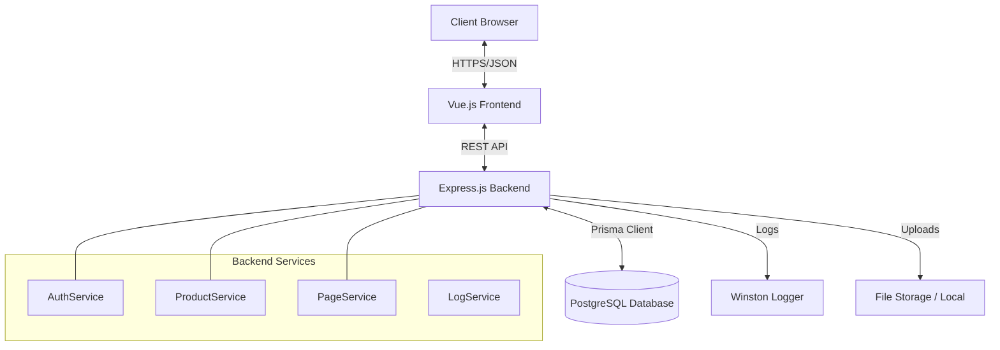
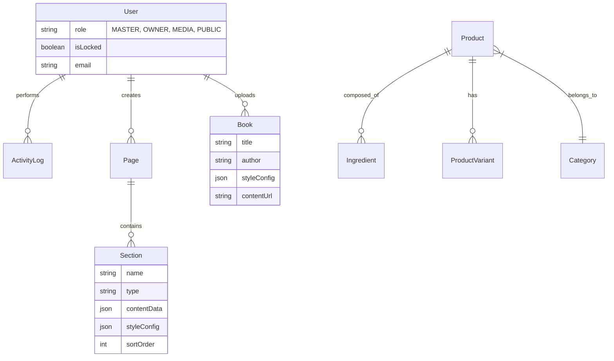
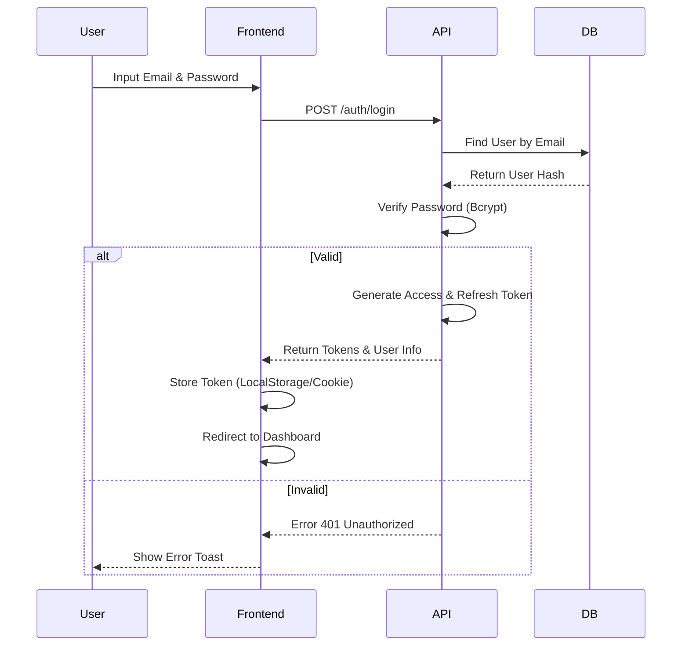

# ☕ CoffeeShop Enterprise CMS (Antitesa)


> **Platform CMS & E-Commerce Terintegrasi untuk Bisnis Modern Coffee Shop.**
> Sistem ini bukan sekadar website, melainkan sebuah *Dynamic Page Builder* dan *Business Intelligence Tool* yang dirancang untuk memberikan fleksibilitas total tanpa mengorbankan keamanan data.

---

## 📑 Daftar Isi

- [Tentang Project](#-tentang-project)
- [Fitur Utama](#-fitur-utama)
- [Arsitektur Teknis](#-arsitektur-teknis)
- [Struktur Folder](#-struktur-folder)
- [Desain Database & Schema](#-desain-database--schema)
- [Alur Aplikasi (Page Flow)](#-alur-aplikasi-page-flow)
- [Instalasi & Setup](#-instalasi--setup)
- [Roadmap Pengembangan](#-roadmap-pengembangan)

---

## 📖 Tentang Project

**CoffeeShop Enterprise CMS (Antitesa)** adalah solusi perangkat lunak *end-to-end* yang memisahkan logika bisnis (backend) dan presentasi visual (frontend) secara tegas namun terintegrasi mulus.

Project ini dibangun dengan **Arsitektur Hybrid**:
1.  **Relational Quality**: Untuk data transaksional (User, Product, Stock) yang membutuhkan integritas tinggi (ACID).
2.  **Document Flexibility**: Untuk konfigurasi tampilan (Page Layouts, Theme Config, Book Styles) yang disimpan sebagai JSONB, memungkinkan kustomisasi tanpa batas.

### Visi & Misi
Menciptakan ekosistem digital dimana pemilik bisnis kopi dapat mengelola seluruh aspek digital mereka—mulai dari konten website, katalog produk yang kompleks, hingga laporan keuangan—dalam satu dashboard terpadu yang aman dan mudah digunakan.

### Mengapa Project Ini Berbeda?
- **Zero-Code Content Management**: Media staff dapat mengubah susunan landing page (Hero, Product Grid, FAQ) hanya dengan *drag-and-drop*.
- **Role-Based Security**: Sistem keamanan berlapis dengan "Master Lock" yang dapat membekukan akses akun manapun jika terdeteksi anomali.
- **Audit Trail**: Mencatat SETIAP perubahan data (siapa, kapan, apa yang berubah) untuk akuntabilitas penuh.
- **Brand Consistency**: Sistem tema terpusat yang menjamin konsistensi warna (Cream, Green, Orange) di seluruh platform.

---

## 🚀 Fitur Utama

### 1. 🎨 Dynamic Page Builder (CMS Core)
Fitur unggulan yang memungkinkan admin menyusun halaman website seperti menyusun Lego.
- **Drag & Drop Sections**: Media Staff dapat menyusun urutan *Hero Banner*, *Text Block*, *Product Catalog*, *Event Calendar*, dll dengan mudah.
- **Live Preview**: Melihat perubahan desain secara real-time sebelum dipublikasikan ke publik.
- **Flexible Content**: Setiap section memiliki konfigurasi JSON sendiri, memungkinkan properti unik (misal: background image, alignment, button link) yang berbeda tiap blok.
- **Global Theme Injection**: Perubahan warna brand utama (Primary Color) langsung diaplikasikan ke seluruh elemen website via CSS Variables.

### 2. ☕ Product Intelligence
Sistem manajemen produk yang dirancang khusus untuk bisnis F&B.
- **Ingredient Tracking**: Mencatat komposisi bahan secara detail (misal: "Latte" = 18gr Espresso + 200ml Susu + 10ml Sirup).
- **Variant Pricing**: Dukungan harga dinamis berdasarkan varian (Hot/Ice, Regular/Large, Extra Shot).
- **Visual Icons**: Upload icon SVG khusus untuk setiap komposisi bahan, memberikan visualisasi menarik bagi pelanggan.
- **Cost of Goods Sold (HPP)**: *[Planned]* Perhitungan otomatis modal per cup berdasarkan harga bahan baku.

### 3. 📚 Digital Library & Merchandise
Modul untuk menjual produk non-kopi.
- **Book Customization**: Kustomisasi tampilan detail halaman buku (font, background color, accent color) secara spesifik per item.
- **Digital Assets**: Dukungan untuk menjual buku digital (PDF) dengan link download aman.
- **Merchandise Management**: Kelola stok baju, alat seduh, dan aksesoris lainnya dengan varian SKU.

### 4. 🛡️ Keamanan & Hak Akses (RBAC)
Sistem membagi user ke dalam 4 level wewenang yang ketat:
- **Master Admin (Level 0)**: Superuser teknis. Memiliki akses penuh, anti-lock, bisa melihat audit log global, dan bisa mengunci akun Owner.
- **Admin Owner (Level 1)**: Pemilik bisnis. Akses laporan keuangan, manajemen staff, dan harga produk.
- **Media Staff (Level 2)**: Tim kreatif. Hanya bisa mengedit konten (Pages, Books, Blogs) dan tema. Tidak ada akses ke data finansial.
- **Public User (Level 3)**: Pengunjung website (Guest/Customer).

### 5. 📊 Reporting & Logs
- **Financial Report**: Export laporan penjualan ke format PDF (layout rapi siap cetak) atau Excel (raw data untuk analisis).
- **Activity Logs (Audit Trail)**: Merekam jejak digital lengkap:
    - **Who**: Siapa yang melakukan aksi (User ID, IP Address).
    - **When**: Kapan aksi dilakukan.
    - **What**: Apa yang berubah (Data sebelum vs sesudah).
    - **Where**: Di modul mana perubahan terjadi (Product, Page, User).

---

## 🛠️ Arsitektur Teknis

Project ini menggunakan stack teknologi modern **MEVN (Metric/Monitor, Express, Vue, Node)** + **Prisma**.

### Backend (Server-Side)
- **Runtime**: Node.js (LTS Version)
- **Framework**: Express.js dengan TypeScript (Strict Mode)
- **ORM**: Prisma (PostgreSQL + JSONB capability)
- **Database**: PostgreSQL 14+
- **Authentication**: JWT (JSON Web Token) dengan Access & Refresh Token rotation.
- **Security**: Helmet (Headers), Rate Limiting, CORS, Bcrypt (Password Hashing).
- **Validation**: Zod (Schema validation untuk Request Body/Params).
- **Logging**: Winston & Morgan (File & Console logging).

### Frontend (Client-Side)
- **Core Framework**: Vue.js 3 (Composition API & Script Setup)
- **Build Tool**: Vite (Lightning fast HMR & Build)
- **State Management**: Pinia (Store management dengan Persistence)
- **Routing**: Vue Router 4 (dengan Navigation Guards untuk Auth & Role)
- **Styling**: Tailwind CSS 3 (Utility-first) dengan konfigurasi warna custom.
- **UI Libraries**:
    - `@tiptap/vue-3`: Headless Rich Text Editor.
    - `@phosphor-icons/vue`: Icon set yang konsisten.
    - `chart.js` & `vue-chartjs`: Visualisasi data dashboard.
    - `vuedraggable`: Fitur Drag & Drop untuk Page Builder.

### Diagram Arsitektur


---

## 📂 Struktur Folder

Project ini menggunakan pendekatan **Monorepo** yang memisahkan `client` dan `server` untuk kejelasan tanggung jawab.

```bash
ANTITESA/
├── .github/                    # CI/CD Workflows
├── .vscode/                    # Shared VS Code Settings
├── FLOW/                       # Dokumentasi Project (Architecture, Install, dll)
│
├── client/                     # [FRONTEND] Vue.js 3 + Vite
│   ├── public/                 # Static Assets (Logo, Robots.txt)
│   ├── src/
│   │   ├── api/                # Axios Instance & Service Modules
│   │   │   ├── core/           # Config Axios (Interceptors)
│   │   │   └── services/       # Auth, Product, Page services
│   │   ├── assets/             # Fonts, Images, Global CSS
│   │   ├── components/         # Atomic Design System
│   │   │   ├── atoms/          # Button, Input, Icon, Badge
│   │   │   ├── molecules/      # FormGroup, SearchBar, Pagination
│   │   │   ├── organisms/      # Sidebar, Navbar, Tables
│   │   │   └── builder-widgets/# Widget Page Builder (Hero, Catalog)
│   │   ├── composables/        # Business Logic (useAuth, usePermission)
│   │   ├── config/             # App Constants & Menu Config
│   │   ├── layouts/            # Template (Dashboard vs Storefront)
│   │   ├── router/             # Vue Router & Guards
│   │   ├── stores/             # Pinia States (Auth, Cart, UI)
│   │   ├── utils/              # Helpers (Date format, Validation)
│   │   └── views/              # Page Views
│   │       ├── auth/           # Login, Locked
│   │       ├── dashboard/      # Admin Pages (Overview, Products, Pages)
│   │       ├── master-admin/   # Superuser Pages (Access, Logs)
│   │       └── storefront/     # Public Pages (Home, Detail)
│   └── ...
│
└── server/                     # [BACKEND] Node.js + Express
    ├── prisma/                 # Database Config
    │   ├── migrations/         # SQL Migrations history
    │   ├── schema.prisma       # Definisi Schema DB
    │   └── seed.ts             # Data Seeding (Initial Admin)
    ├── src/
    │   ├── config/             # Env & DB Connection
    │   ├── constants/          # Enums (Roles, Messages)
    │   ├── controllers/        # Request Handlers
    │   ├── dtos/               # Data Transfer Objects (Validation)
    │   ├── interfaces/         # TypeScript Types
    │   ├── middlewares/        # Auth, RBAC, Upload, Error Handling
    │   ├── routes/             # API Endpoint Definitions (v1)
    │   ├── services/           # Business Logic & DB Calls
    │   ├── utils/              # Password, JWT, File Helper
    │   ├── app.ts              # Express App Setup
    │   └── server.ts           # Entry Point
    └── ...
```

---

## 🗄️ Desain Database & Schema

Database dirancang menggunakan **PostgreSQL** dengan memanfaatkan fitur **Relational** dan **JSONB** secara bersamaan.

### Entity Relationship Diagram (ERD) Simplified



### Penjelasan Schema Penting:

1.  **`User`**:
    *   `role`: Enum (MASTER_ADMIN, ADMIN_OWNER, MEDIA_STAFF, USER_PUBLIC).
    *   `isLocked`: Boolean untuk fitur "Master Lock" yang membekukan akun.

2.  **`Product`**:
    *   Sentral dari manajemen inventori. Terhubung ke `Category`, `Ingredient` (komposisi), dan `ProductVariant` (opsi harga).

3.  **`Page` & `Section` (CMS)**:
    *   `Page`: Menyimpan metadata halaman (Title, Slug, SEO).
    *   `Section`: Menyimpan blok konten. Field `contentData` (JSON) menyimpan struktur fleksibel seperti `{ "title": "Welcome", "bgImage": "url..." }` yang berbeda-beda tergantung `sectionType` (HERO, CATALOG, TEXT, etc).

4.  **`ActivityLog`**:
    *   Table audit yang menyimpan snapshot `details` (JSON) berisi data sebelum dan sesudah perubahan.

---

## 🔄 Alur Aplikasi (Page Flow)

### 1. Authentication Flow


### 2. Page Editing Flow (CMS)
1.  **Media Staff** login dan masuk ke menu **Pages**.
2.  Memilih halaman untuk diedit (misal: "Home").
3.  **API** mengirimkan data `Page` beserta relasi `Section` yang sudah diurutkan.
4.  **Frontend** merender komponen dinamis berdasarkan `section.sectionType`.
5.  Staff melakukan **Drag & Drop** urutan section atau mengedit properti (Teks, Gambar) via form di sidebar.
6.  Klik **Save Changes**.
7.  **Frontend** mengirim payload JSON struktur terbaru ke API.
8.  **API** memvalidasi dan mengupdate record di database.
9.  **Activity Log** mencatat aksi "UPDATE PAGE".

### 3. Public Visitor Flow
1.  Visitor membuka `ANTITESA.com`.
2.  **Frontend** (Storefront Layout) me-request `/api/pages/slug/home`.
3.  **Backend** mengembalikan konfigurasi halaman.
4.  **Frontend** melakukan *Dynamic Component Rendering* (`<component :is="section.type" />`) untuk menampilkan halaman sesuai desain terkini.
5.  Visitor melihat produk, sistem me-request `/api/products` dengan filter kategori.

---

## ⚙️ Instalasi & Setup

Ikuti panduan ini untuk menjalankan project di lingkungan lokal (Development).

### Prasyarat
- **Node.js** v18 atau lebih baru.
- **PostgreSQL** v14 atau lebih baru.
- **Git**.

### 1. Setup Backend (Server)
```bash
# Masuk ke folder server
cd server

# Install dependencies
npm install

# Setup Environment Variables
cp .env.example .env
# EDIT .env: Sesuaikan DATABASE_URL, JWT_SECRET, dll.

# Setup Database & Seeding
npx prisma migrate dev --name init
npx prisma db seed  
# (Seed akan membuat user Master Admin default: master@coffeeshop.com / MasterAdmin@2025)

# Jalankan Server Development
npm run dev
# Server berjalan di http://localhost:3000
```

### 2. Setup Frontend (Client)
```bash
# Masuk ke folder client
cd client

# Install dependencies
npm install

# Setup Environment Variables
cp .env.example .env
# Pastikan VITE_API_BASE_URL mengarah ke http://localhost:3000/api/v1

# Jalankan Frontend Development
npm run dev
# Aplikasi berjalan di http://localhost:5173
```

### Akses Default
- **Frontend**: [http://localhost:5173](http://localhost:5173)
- **Backend API**: [http://localhost:3000](http://localhost:3000)
- **Prisma Studio** (DB Viewer): `npx prisma studio` (di folder server)

**Akun Login Default:**
- **Email**: `master@coffeeshop.com`
- **Password**: `MasterAdmin@2025`

---

## 📍 Roadmap Pengembangan

- [x] **Fase 1: Foundation**
    - Setup Monorepo & Architecture
    - Database Schema Design
    - Auth System (JWT & RBAC)
- [x] **Fase 2: Core CMS**
    - Dynamic Page Schema
    - Product Management (Basic)
    - Admin Dashboard UI
- [x] **Fase 3: Advanced Features**
    - Drag & Drop Builder UI on Frontend
    - Ingredient Calculator Logic
    - Digital Library Frontend
    - Report Generation (PDF)
- [ ] **Fase 4: Polish & Deploy**
    - Unit & Integration Testing
    - CI/CD Pipeline
    - Production Optimization

---

*Copyright © 2026 Antitesa Development Team. All Rights Reserved.*
